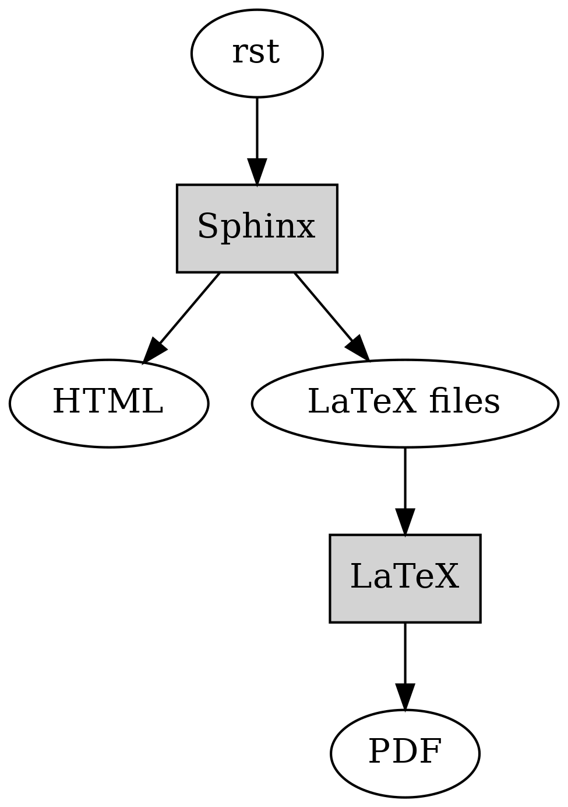
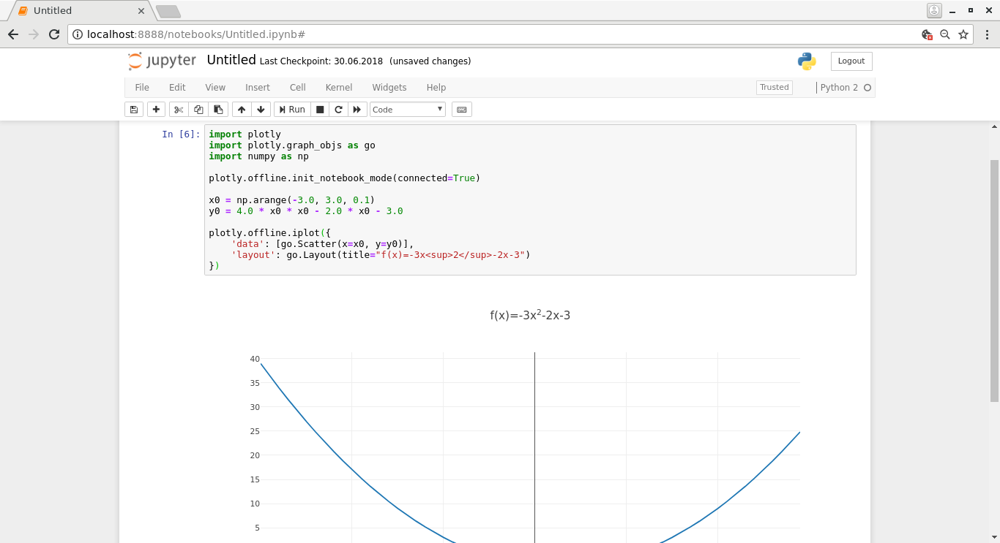

Tech behind this book
---------------------

This chapter describes the technology used for creating this book.

The text is written using vim, in a format called *reStructuredText* (rst). Rst is fairly simple to write and looks like this:

.. code-block:: rst

  Title
  -----

  This is some text.

  .. code-block:: python

    print 'foo'

  Here's an image.

  .. image:: ../material/foo/bar.png

After I've written a section in rst, I feed it to *Sphinx*. Sphinx is a Python tool that can generate documentation for a piece of software, but it can apparently also be used for books. It takes rst as input and can generate output in various formats such as HTML and LaTeX (which can be converted to PDF - which can be printed to a physical book). Sphinx also extends rst by defining some additional directives, for example for generating a table of contents.

I had Sphinx generate a Makefile for myself so after I've written a new section, I can run e.g.:

.. code-block:: bash

    $ make html latexpdf

This command will generate both HTML and PDF from the input rst files which are defined in the main table of contents.

It's worth going a bit more into detail on LaTeX. LaTeX (often pronounced "lah-tech" - as in "technical") is a typesetting system which takes LaTeX files as input and outputs files such as PDF. LaTeX input files, again, look e.g. like this:

.. code-block:: latex

  \section{Javascript}
  \label{\detokenize{js_index:javascript}}\label{\detokenize{js_index::doc}}
  
  \subsection{Guessing game in JS}
  \label{\detokenize{js:guessing-game-in-js}}\label{\detokenize{js::doc}}
  Let’s write a guessing game. This game is fairly simple: the computer thinks of a number between 1 and 25, and you need to guess what it is. The computer will give hints such as “my number is smaller” or “my number is bigger” on wrong guesses.
  
In other words, it supports several different commands that describe what the output should be like. Sphinx generates LaTeX files from the rst input, and also generates and runs a Makefile which runs the Perl script latexmk which runs pdflatex which actually generates the PDF.

The following diagram displays the overall flow. The grey boxes represent applications while the white spots are data.

Apart from using Sphinx, another alternative I read about afterwards was Asciidoctor, which is software that takes files written in AsciiDoc syntax as input (which has some similarities to rst, e.g. is also plain text) and can generate various outputs such as HTML and PDF.

Diagrams
========

The dot format was discussed in section "Graphs", and this book uses that format, with some additions for subgraphs, and the Graphviz tool for most of the diagrams.

There are a few diagrams not generated with Graphviz, though. When I needed to create some diagrams manually or needed specific symbols, like with the diagrams on electric circuits, I used draw.io which is an online diagram maker. The diagrams created using draw.io can be exported and imported as XML. Furthermore, draw.io can turn the diagrams to images such as .png files.

Apart from Graphviz and dot, in the chapter "Quadratic formula" as well as the section "NP-hard problems" I needed to generate images of a quadratic function and points on a plane respectively. For this I used a *Jupyter notebook*. Jupyter notebook is a web application that allows the user to write Python code and display the results. Because Jupyter notebooks make it easy to load, analyse and visualise data and share the results, they're popular among people who need to work with data.

Within the Jupyter notebook, I used the Python libraries *plotly* and *numpy*. Plotly makes it easy to create plots within Python code, and numpy makes it easy to work with numbers in larger scale in Python, such as multi-dimensional arrays and matrices.

The following screenshot illustrates the Jupyter notebook used for generating the quadratic function diagram:

Here, the Jupyter server is started on localhost and connected to using the browser. The code at the top is the code needed for generating the plot. The variables x0 and y0 use numpy constructs to generate arrays of the data to display: x0 is an array with values from -3 to 3 with steps of 0.1, and y0 is an array where each value depends on the corresponding element in x0 as described in the formula. Finally, the two arrays are provided to plotly for generating the diagram. Plotly supports exporting the diagram to a PNG file.

Miscellaneous
=============

The screenshots, where necessary, were created using scrot. Scrot is a Unix command line tool that can create screenshots. I typically instruct it to wait for two seconds (so I can bring the relevant window to focus), then take a screenshot of the currently active window and store it as a pre-defined file name. This workflow works fairly well as it saves me from having to cut, crop or save images.

Another command line suite which came very handy is ImageMagick which allows easy modification of images (cropping, resizing, converting between formats etc.) from the command line.

While generating the PDF for the print version, I noticed many of the diagrams generated using dot had too low DPI (dots per inch). I found out I can increase the DPI by passing the command line flag "-Gdpi=300" to dot, but this meant I needed to regenerate all the PNG files from the dot files. The following command took care of this for me (split to multiple lines for readability):

.. code-block:: bash
    :linenos:

    for file in $(find . -name '*.dot')
    do
        pushd $(dirname $file)
        dot -Tpng -Gdpi=300 $(basename $file) > $(basename $file .dot).png
        popd
    done

Let's see what this does:

* Line 1: We find all the dot files within the current directory or any subdirectories, and loop over them
* Line 3: We first capture the *directory* where the file resides using shell expansion ("$(...)"), and then *push* this directory to a stack. Bash supports a stack for directories such that one can push a directory in the stack, which changes the current working directory and also allows the directory to be *popped* later which changes the current working directory back to what it was before the push.
* Line 4: We capture the *base name* of the dot file - this is the file name without the directory part. We also run "$(basename $file .dot).png" which first removes the ".dot" suffix from the file name and then adds the ".png" suffix to it. Running this dot command for e.g. a file "foo.dot" effectively runs dot on "foo.dot" to generate a "foo.png".
* Line 5: We pop the directory from the stack, arriving at the previous directory. Doing this allows our script (or one-liner) to end up in the directory we started in.

GitHub provides a hosting service for hosting web pages which I also experimented with for the purposes of this book. There's a command to publish the generated HTML on GitHub pages ("git subtree push --prefix _build/html/ origin gh-pages") but as this command was difficult to remember I created a simple shell script "publish.sh" with only this command as the contents. This way, once I've committed a new section, I could run "git push origin master && ./publish.sh" which would upload all the changes online.

The dependency diagrams were generated using dot. I have the master dot file which describes the actual dependencies, but this dot file doesn't include the actual section titles, only the file names. I then wrote a simple shell script to read the section titles from the rst files and generate dot statements which cause the titles to be used as labels in the diagram. These generated dot statements, together with a dot header and the master dot file are then concatenated to the final dot file which describes the dependencies between the sections.

After the dependencies between sections are described in a dot file, another dot file is generated from this input which describes the dependencies between chapters (one chapter can include multiple sections). This is done in a simple Python script which parses a) the section dependencies from the dot file, and b) which sections belong to which chapters from the rst files. Finally, a shell script is run which passes the two dot files to "tred" to remove unnecessary edges and creates the final PNG images from the dot files. This flow is run as part of the Makefile invocation.

The source code for the book is versioned using git and is publicly available in GitHub at https://github.com/anttisalonen/progbook.

