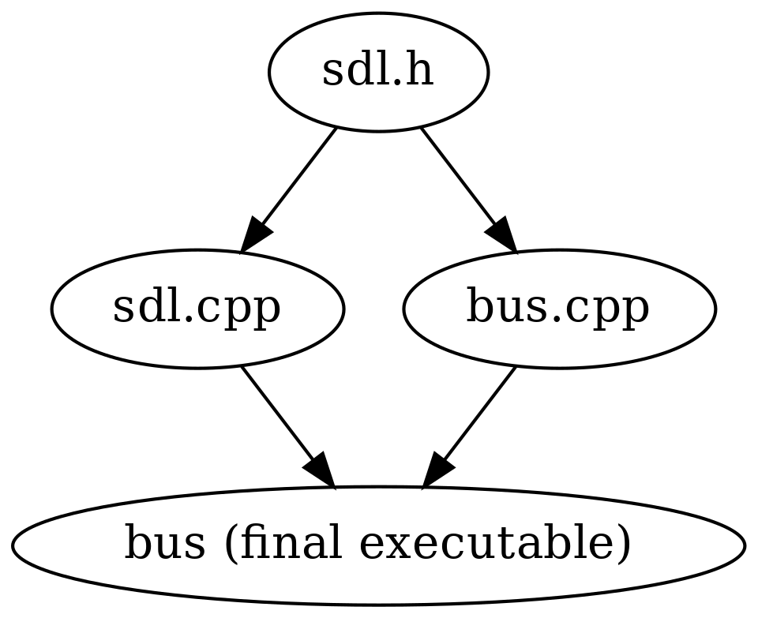

Monolithic way - merging and putting it all together
----------------------------------------------------

We now have the logic to create incoming bus data from GPS as well as from the schedules. Let's merge these to the final output that will be shown on the display.

Like in Python, our merging logic could work e.g. the following way:

* Combine the two arrays (vectors) to one
* Find out which buses (route number/start number combinations) have already passed, and for which buses GPS data exists
* From our array, filter out the entries which originate from the schedule where we either have the GPS arrival data or know they have already passed
* Sort the final array

The output data format can be the same as the input data format, i.e. data that tells the route number, assumed arrival time and the kind (scheduled or estimated from GPS data) for each bus. Once we have this data we can create the labels required for the display.

Here are some hints to help you get started:

* You can append one vector at the end of another by using the following code: vec1.insert(vec1.end(), vec2.begin(), vec2.end());

   * The first parameter tells the std::vector::insert() member function where to start appending. The second and third parameters tell from where to where to append.

* In Python we used sets to take note which buses have already passed or we have GPS arrival data on. We can do the same in C++ but as the amount of data is relatively small it should be no problem to use std::vectors for holding this data. Similarly to Python, tuples can be used to identify the buses. You'll need to note both the route number and start number. In other words, the type for the data could be e.g. std::vector<std::tuple<int, int>>.
* We've already seen how to remove (filter) elements from a vector. Finding an element in a vector to use in a predicate can be done like this:

.. code-block:: cpp

    return std::find(vec.begin(), vec.end(),
           std::make_tuple(route_nr, start_nr)) != vec.end();

This code searches the vector "vec" for a tuple which has the values "route_nr" and "start_nr". std::find returns vec.end() if the element was not found. Hence, e.g. the following code would remove all elements from a vector "vec1" that are included in another vector "vec2":

.. code-block:: cpp

    std::remove_if(vec1.begin(), vec1.end(),
            [&](const auto& bi) {
                return std::find(vec2.begin(), vec2.end(),
                       std::make_tuple(bi.route_nr, bi.start_nr)) != vec2.end();
            });

*Exercise*: Implement the merge function and test it.

Parsing a timestamp
===================

We're starting to have a decent program but it's not yet parsing the command line options (unless you already added it). We'd want to support e.g. the following command line:

.. code:: bash

    $ bus "Bus stop name here" gps_raw.txt gps.txt sched.txt 10:23

Here, the first parameter is the bus stop name and will only be used as a string to display on the final screen. The next three parameters are input file names. The final one is the current time.

To be precise, according to the spec, the process should only receive only one parameter, namely the bus stop name, but we can make things a bit simpler for us for now. If necessary we can wrap most of this in a shell script if necessary, except for the time stamp. While we could query the current time stamp in our code, for now we can make things simpler (and easier to test) and supply the time as a command line parameter.

One question when implementing the command line parsing might be about parsing a timestamp in format "hh:mm". We need to split this string by the ":" character, similarly to s.split(':') in Python. This can be done in C++ e.g. using the following code:

.. code-block:: cpp
    :linenos:

    const char* time;
    // FIXME: set time to hold a string in "hh:mm" format here
    std::string t(time);
    auto ind = t.find(":");
    if(ind == std::string::npos)
        throw std::runtime_error("Could not parse time");
    int h = std::stoi(t.substr(0, ind));
    int m = std::stoi(t.substr(ind + 1));

Going this line by line:

* Line 3: We convert time from char* to an std::string
* Line 4: Find the index of the character ':'. std::string::find will return std::string::npos if the character was not found.
* Line 7: We find the *substring* within t that holds the hour. The function std::string::substr(a, b) will return a string that includes characters from a to b (a inclusive, b exclusive).
* Line 7: We then convert the string to an int using the built-in function std::stoi (string to int).
* Line 8: We repeat this for minutes, but pass only one parameter to std::string::substr. This causes the function to return all characters from the given index until the end.

*Exercise*: Look up the reference for the function std::string::substr.

*Exercise*: Add command line argument parsing to your code. It should receive the current timestamp in "hh:mm" format, the name of the bus stop to display, and three file names for the schedule data, historical and current GPS data respectively. Check the value of argc to ensure you're receiving the correct number of parameters. Exit with an error message and a return value of 1 otherwise.

Displaying the labels
=====================

As part of our sections around SDL we put together a program that will display the labels as required, and take a filename as input which must contain the labels to be displayed. While we could generate such a file in our C++ program and then call that program, the cleaner way seems to be to call the existing code directly.

What we need to do for this is:

* Refactor the existing code which displays the screen using SDL. The constructor of the class we wrote previously took the file name as the source for the labels, but for our purposes it would be better if it took an std::array<std::string, 23> as a parameter instead and used the contents of that array directly. We can add another constructor for this purpose.
* Instantiate an object of that class in our C++ program, putting together and passing it an std::array<std::string, 23>
* Call the relevant member function or functions of that object such that the correct visual output is generated

Now, in order to use both our existing SDL code and our new C++ code together, you have a couple of options:

* Copy-paste all the existing SDL code to our new .cpp file
* Expose the existing SDL code in a *header file*, #include that header file in our new .cpp file, and compile and link the two .cpp files to one program

As the first one introduces duplicate code we'll go with the second option.

Header files
~~~~~~~~~~~~

A header file in C and C++ typically describes the interface of the functionality implemented in the corresponding .cpp file. This means that it shouldn't have any function definitions but it should declare the functions that are defined in the .c or .cpp file and define the data structures (including classes) that may be used from other files.

In our case, our header for exposing the SDL functionality could look like this:

.. code-block:: cpp
    :linenos:

    #pragma once

    #include <array>
    #include <string>

    #include "SDL.h"
    #include "SDL_ttf.h"

    class SDL_Schedule {
        public:
            SDL_Schedule(const std::array<std::string, 23>& labels);
            SDL_Schedule(char* fn);
            ~SDL_Schedule();
            void display();

        private:
            void init();

            TTF_Font* m_font;
            SDL_Window* m_screen;
            SDL_Renderer* m_renderer;
            SDL_Color m_col_white;
            SDL_Color m_col_yellow;
            std::string m_labels_filename;
    };

Let's see what we have.

* Line 1: We include a *header guard* which ensures the header file will only be compiled once per compilation unit (typically a .cpp file, plus any headers that were #included). Without "#pragma once", if one were to #include this header file more than once, either directly or indirectly, we'd have declared the class multiple times, leading to compile errors. Another way to define a header guard is to use e.g. "#ifndef MY_HEADER_H" followed by "#define MY_HEADER_H" at the top of the header file and "#endif" at the end of the header file. These are a commonly used way to say "if this random string hasn't yet been defined, define it, then define the rest of the header, end if", i.e. "only include this file once".
* Lines 3-7: We #include the header files that are required for our class definition.
* Lines 9ff: We actually define our class. We don't define any member functions here but only include the definition of the class. The logic is that function definitions can only be defined once per executable program but the data type needs to be visible to any compilation unit that defines variables of that data type.

We should end up with e.g. have the following structure:

* sdl.cpp - this includes the member function definitions of the class SDL_Schedule. It #includes sdl.h. It must not include a main function. If it does then comment it out, or move it to another file.
* sdl.h - this has the SDL_Schedule class definition as per above.
* bus.cpp - this has our other logic, and most importantly, the main function. It #includes sdl.h and defines and uses a variable of type SDL_Schedule.

The following diagram summarises the dependencies.

Now, generally in C and C++, source files are compiled to object files (binary files including the machine code instructions that were generated from the input C code), and one or multiple object files can be linked to an executable. When you run e.g.:

.. code-block:: bash

    $ g++ -o hello hello.cpp

...what the compiler actually does is implicitly convert all the intermediate steps to one. To explicitly compile an object file and link it to an executable, you'd do:

.. code-block:: bash

    $ g++ -c -o hello.o hello.cpp
    $ g++ -o hello hello.o

Here, we first instruct the compiler to generate an object file with -c, then ask the compiler to link the final executable (by not specifying -c), passing it the object file as input. (Instead of calling g++, depending on the C++ compiler, one could also call the linker directly, e.g. ld.)

Now, when we have two .cpp files, we have two options:

.. code-block:: bash

    $ g++ -o hello file1.cpp file2.cpp

Here, we pass the compiler two .cpp files to compile to a single executable. The compiler compiles each file separately, and finally invokes the linker to link them.

Alternatively we can use:

.. code-block:: bash

    $ g++ -c -o file1.o file1.cpp
    $ g++ -c -o file2.o file2.cpp
    $ g++ -o hello file1.o file2.o

Here, we explicitly compile each .cpp file to an object file by passing -c and finally tell the compiler to link all of them to an executable. The good thing about this method is that is improves the time it takes to compile our program; the former will always compile each .cpp file while with the latter, you can skip compiling the .cpp files that haven't been changed since the last compilation. Makefile rules come in handy here.

.. topic:: #include <header> or #include "header"?

  We've seen two ways to include headers: either using the angled brackets or quotes. The difference is in the path the C++ compiler uses to find the header file; for angled brackets, it searches in the system directories which are dependent on the compiler and typically include the libraries installed on the system while the quoted brackets mean the compiler first searches in the local directory before going to the system directories. Typically you should use quotes for the header files in the project you're currently working on, and angled brackets for libraries that aren't included in your current project. SDL2 recommends a bit different approach and suggests the user should always use quotes for including SDL2 headers.

  Furthermore, you can specify more directories to search for headers when invoking the compiler. The switch -I followed by a path adds the given path to the list of directories to use when searching for headers. E.g. the SDL2 command sdl2-config --cflags, which we use during compilation, could include e.g. the string "-I/usr/include/SDL2" when expanded, meaning the compiler should look for the headers in that directory.

Compiling and linking our program becomes more interesting when external libraries like SDL2 are used. To make it short, when compiling, the compiler needs to know where to find the header files. When linking, the compiler needs to know where to find the library files. In case of SDL2, we could e.g. use the following:

.. code-block:: bash

    $ g++ -Wall -I/usr/include/SDL2 -c -o file1.o file1.cpp
    $ g++ -Wall -I/usr/include/SDL2 -c -o file2.o file2.cpp
    $ g++ -L/usr/lib -lSDL2 -lSDL2_ttf -o hello file1.o file2.o

Here, we pass the include path to the compiler while compiling using the -I switch, such that the compiler will be able to find the SDL2 header files.

After compilation, we pass the compiler the path where to find libraries using the -L switch, and tell it which libraries to link using the -l switch (in this case, SDL2 and SDL2_ttf).

SDL2 provides us with the helper tool sdl2-config which can generate these for us. sdl2-config --cflags generates the correct -I line (and more) while sdl2-config --libs generates the switches required by the linker. This is the reason we call and expand sdl2-config when we compile our code that uses SDL2.

*Exercise*: Use our SDL code from our bus logic code. Create a new header file or files as necessary. Compile and run your code. Fill out all the holes so that your code will do everything: parse the input files, generate the labels required for the display and display the labels. Create an std::map to map route numbers to names.

If you made it here, congratulations.
