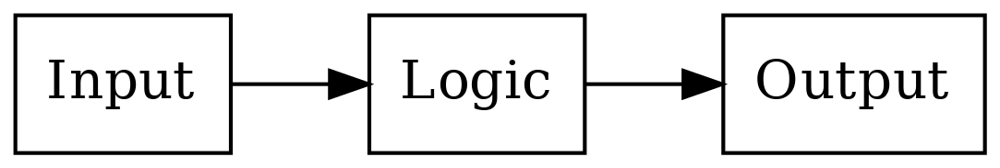

Ok, but seriously, how does a computer work?
--------------------------------------------

  On two occasions, I have been asked [by members of Parliament], "Pray, Mr. Babbage, if you put into the machine wrong figures, will the right answers come out?"...I am not able rightly to apprehend the kind of confusion of ideas that could provoke such a question.

  -- Charles Babbage (1864)

To reduce the modern computer to the essentials, let's build a following, very simple device: a hand-held device with a touch screen. We need to implement very simple functionality for the device:

* If the user taps on the bottom half of the screen, the screen must turn green.
* If the user taps on the top half of the screen, the screen must turn red.

This device is very simple but will cover the same principles shared by nearly all computers, as we shall see.

The following diagram explains the general concept for computers:

In other words, there's some input, some logic processing the input and creating some output. In our hypothetical device, the input is taps on the touch screen, and the output is what's shown on the display. In our "Hello world" program, there was no input, and the output was a text in the terminal.

To be more specific, the input and output blocks like a touch screen and a display are *digital devices*; they *communicate* with the logic part using binary signals. Generally speaking, the input and output devices come with some kind of a *technical specification* or *data sheet* which describe how to interact with them. In our case, the hypothetical data sheet for our hypothetical touch screen contains the following:

"The X coordinate of the latest tap is output at signal A. The value is either 0 (bottom half of the screen) or 1 (top half)."

Similarly the hypothetical data sheet for the hypothetical display contains:

"To set the colour of the display, set the signals X and Y as desired. The colour is displayed as based on the following table:"

+---+---+-----------------------------+
| X | Y | Colour shown on the display |
+===+===+=============================+
| 0 | 0 | Black                       |
+---+---+-----------------------------+
| 0 | 1 | Green                       |
+---+---+-----------------------------+
| 1 | 0 | Red                         |
+---+---+-----------------------------+
| 1 | 1 | Blue                        |
+---+---+-----------------------------+

(This display can only show one colour across the whole screen, i.e. it only has one pixel.)

The logic part in the middle ends up doing at least three things:

* Receives information from the input blocks using logic signals
* Performs the actual logic (in our case, mapping the position of the tap to the output colour)
* Sends information to the output blocks using logic signals

In our case, the logic in Python-like code could look like this:

.. code-block:: python

    if user_tap_x_coordinate == 0:
        screen_color = 1
    else:
        screen_color = 2

Here, the variable "user_tap_x_coordinate" represents the touch screen input which holds the X coordinate of the position where the user tapped last. The variable "screen_color" represents the display output which is used to control the colour shown on the display.

In other words, all the logic needs to do is read the input from the touch screen, compare this with predefined values, and depending on the result of the comparison, set the correct signal for the display colour.

*Exercise*: Write the truth table for this logic. It should have A as the input signal and X and Y as the output signals.

*Exercise*: Design, using pen and paper, the circuit for this logic.

Software and hardware
=====================

We've now designed a device that will display different colours depending on where the user taps the screen. Let's further imagine we mass produce thousands of these devices. The device is an instant hit but a new feature requirement appears: some users would like to change the way the display shows the colours. For example, a user would want the device to show black if the device is tapped anywhere on the bottom half of the screen and blue otherwise.

Because we designed the logic that decides the display colour in the hardware, that is, in the digital logic using logic gates, making this change isn't possible without actually changing the logic and manufacturing a new device with a changed logic. To circumvent this and to make it possible to change the way the colours are displayed without having to manufacture a new device, we can make our device *programmable*. (This e.g. allows app development on current smartphones, though smartphones also use software for e.g. the OS.)

When a device is made programmable, it doesn't contain the logic for its primary purpose in hardware using logic gates. Instead, the logic is stored somewhere else as *instructions*, and the device instead has logic to perform operations *depending on* these instructions. Then, by changing the instructions one can change the behaviour of the device without having to manufacture a new device. We also have to include *memory* on the device. This is where the instructions are stored.

In other words, what's required is:

* Removing the logic in hardware for the primary purpose of the device
* Encoding this logic in a list of instructions instead
* Adding some memory to the device which holds the list of instructions
* Adding logic in the hardware to read and understand these instructions
* Making it possible to change the list of instructions later

Here, the list of instructions is the *software* and the logic that reads and understands these instructions is the *Central Processing Unit*, or *CPU*. Each bit in memory can be implemented using logic gates. Memory can be seen as an array of boxes, each holding either a 1 or a 0, with the ability to change the contents as needed using signals.

We've now covered some aspects as to how a computer works, but haven't yet covered how a CPU works.

CPU
===

A CPU receives some code in some form and must execute it. Let's take a look at our logic for our original program again:

.. code-block:: python

    if user_tap_x_coordinate == 0:
        screen_color = 1
    else:
        screen_color = 2

Now, the above is possibly somewhat understandable to us as humans but it's not really a list. Typically, converting this to a list of instructions would make it look more like this:

.. code-block:: bash

    1: COMPARE A WITH 0
    2: IF FALSE THEN JUMP TO 6
    3: SET X TO 0
    4: SET Y TO 1
    5: JUMP TO INSTRUCTION 1
    6: SET X TO 1
    7: SET Y TO 0
    8: JUMP TO INSTRUCTION 1

Here, e.g. the first instruction, COMPARE, compares the two operands given to it, and stores the result in memory to be used for the next instruction.

Typically, a CPU needs to *decode* the instructions from the memory. For example, the instruction COMPARE may be defined as the input values "001". This means that the digital logic would read three bits from memory, see if they match the values "001", and if so, perform the comparison. Each instruction has a number that it corresponds to, and when storing the software in memory, the software would need to be stored in the format that the hardware expects for the system to function correctly.

We now have a list of instructions such that each kind of instruction, e.g. COMPARE, SET etc. can be implemented in hardware using logic gates. By implementing each instruction in the hardware and making it possible to modify the list of instructions independently of the hardware we've made our device programmable.

This was a rather high level overview of how a computer and a CPU work, but it should do for now, such that we can start to investigate how to actually write software.
