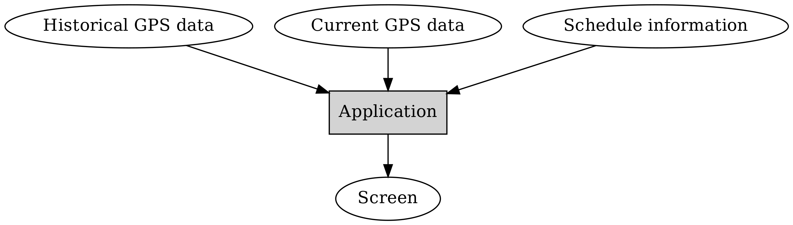
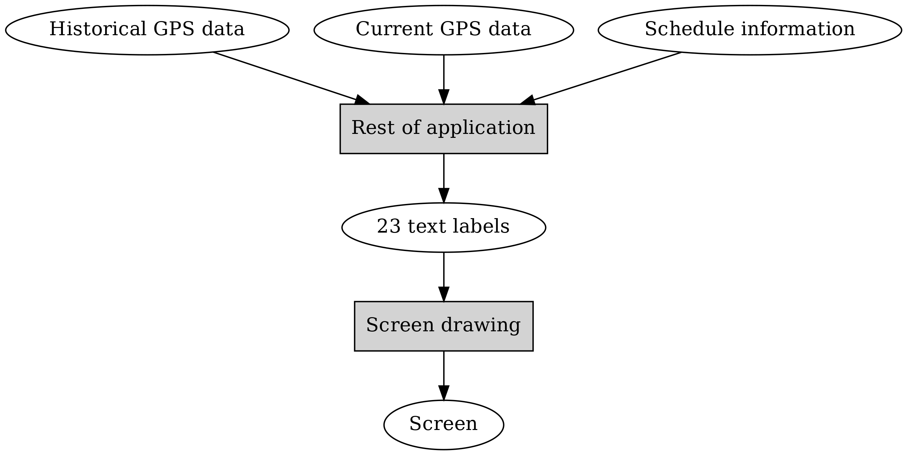
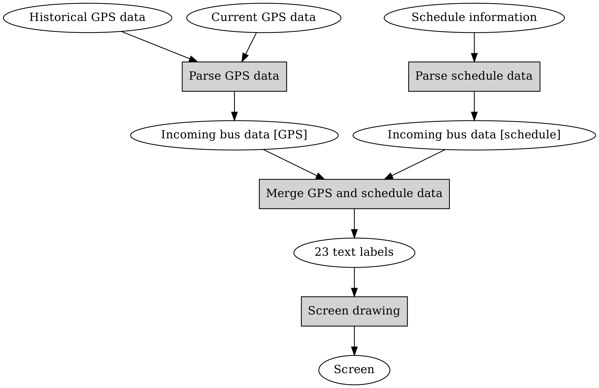

Breaking software down to components
------------------------------------

  Controlling complexity is the essence of computer programming.

  -- Brian Kernighan

So, we now have the requirements captured to the point where we can start specifying the software, i.e. how to fulfil the requirements.

We have some understanding of the inputs and the outputs of our software: the output is the visual output on the screen. The main inputs, ignoring minor ones such as the name of the bus stop, are the bus schedules, the historical GPS data, and the current GPS data. The first two are fixed while the last one changes every ten seconds or so. How would we go about actually planning how to write this software?

Drawing this as a diagram - we'll start with this:

Here, round items represent some or other kind of data, while square, grey boxes represent logic, or software components.

As a thought exercise, we should further assume we have a team of software engineers, e.g. five people assigned to work on this. Ideally all of them would have something useful to do at all times.

Keeping this in mind, one very useful way to decompose software to identify the components is to specify *interfaces* between components, i.e. the inputs and outputs required for each component.

In order to identify the components, we could start e.g. from the end, i.e. the final output, or the output on the screen. The requirement specification gave us an example of this: the first row having the current date and the bus stop name, other rows having the time of arrival, bus route number and destination for each of the upcoming buses. If we treat this as a separate component then we can say the purpose of this component is to display the input data, whereby the input data simply is a few text labels. A few being 23 to be exact - two on the first row, then three on each following row, times seven.

We've now identified our first component:

Now, let's find out how to generate these 23 text labels. The first two are relatively trivial in that we don't depend on the main inputs for them. How do we know whether we should use the GPS data or the schedule data? The requirement spec says we should use GPS data when available and schedule data otherwise. It seems just figuring out which data to use or not is worthy of another component. This also implies we could have one component processing the GPS data, and one component processing the schedule data.

So we could have one component that reads in some kind of GPS data and some kind of schedule data, with the goal of outputting 23 text labels. What should the input formats be for this component? The inputs will be generated by the components handling the GPS and the schedule data, and it seems simplest to have a single format for these two. Putting all of this together, we have:

Now, it looks like we've identified our main components. We can then further define the functionality of the components as well as the interfaces. First the components:

* Screen drawing: takes 23 strings as input, with the purpose of drawing these on the screen
* Merge GPS and schedule data: takes two incoming bus data sets as input, finds the seven buses that seem to arrive at the bus stop first, preferring buses with GPS information if available, and generates 23 strings as output which identify the bus route numbers, destinations and the times of arrival. The input data will need to include the start number so we can match GPS entries with schedule entries.
* Parse GPS data: read in the GPS data and calculate the estimated arrival time for each bus for which GPS data exists using the algorithm specified in the requirements (average time in historical data for that location), and output the bus route numbers, start numbers and estimated time of arrival
* Parse schedule data: read in the schedule data and output the bus route numbers, start numbers and planned time of arrival for the next few buses that are next expected at the bus stop

Then the interfaces:

* 23 text labels: 23 strings (trivial, e.g. in an array).
* Incoming bus data (same format for whichever source): for each incoming bus, the route number, the start number, the type of arrival (estimated from GPS data or planned) and the time need to be captured. The data format itself could then be e.g. an array of structs, whereby each struct contains this information.

It's worth pointing out that identifying the components and the interfaces is closer to software design and architecture, and less about actual coding, and hence there is no obvious right or wrong answer - different people will end up with different designs.

Engineering specification
=========================

Now, as mentioned before, we will write two different engineering specifications and have two different implementations to fulfil the requirements, for the purpose of understanding the different trade offs between software design decisions.

The first specification will follow the *Unix philosophy*. The Unix philosophy originates from the developers of Unix, including Ken Thompson, Dennis Ritchie and Doug McIlroy, and emphasises minimalist, modular software development. It was later summarised this way:

  This is the Unix philosophy: Write programs that do one thing and do it well. Write programs to work together. Write programs to handle text streams, because that is a universal interface.

  -- Doug McIlroy

The Unix philosophy has also been summarised as "KISS", or "Keep it simple, stupid". Much has been written about the Unix philosophy but applying it to our problem at hand, we could arrive at the following engineering spec:

.. topic:: Engineering spec 1

  The software shall consist of five executables: parse_gps, sched, merge and display to implement the main behaviour and a main executable, bus, to glue them together.

  "parse_gps" shall take three parameters: current time, filename identifying the current GPS data (gps_raw.txt) and filename identifying the historical GPS data (gps.txt). It shall output, to stdout, the incoming bus data in the following format:

  * Five integers per row
  * Several rows (as many as necessary)
  * First integer is the bus route number
  * Second integer is the start number
  * Third is the hour of estimated arrival
  * Fourth is the minute of estimated arrival
  * Fifth is the identifier for the type: 0 for GPS data, 1 for schedule data, 2 if the bus has already passed the bus stop

  For buses that have already passed the bus stop, the time (hour and minute) can be zeroes.

  "parse_gps" shall read in the two input files, then, for all buses with current GPS data, calculate the estimated arrival time, and finally print out the incoming and passed buses in the format as specified above.

  "sched" shall take two parameters: current time and filename identifying the schedule data (sched.txt). It shall output, to stdout, the incoming bus data in the same format as "parse_gps". It shall find the next 50 buses planned to approach the bus stop and output the data for these.

  "merge" shall take four parameters: our bus stop name, current time, and filenames for the output of "parse_gps" and "sched". It shall output, to stdout, 23 lines, each one containing the text for one label, from top to bottom, from left to right, i.e. the bus stop name, current time, then route number, destination and arrival time for the next seven buses.

  "display" shall take one parameter: a filename for the output of "merge". It shall output, to a window in a test environment, the bus information as specified in the requirements. It shall read the contents of the input file every ten seconds to update the output view.

  "bus" shall take no parameters. It shall run "parse_gps", "sched" and "merge" every ten seconds, such that the final output file is updated. It shall start "display" in the background with the output of "merge" as the input parameter.

This is a fairly high level spec - it doesn't specify the contents of the individual components - but it does specify the interfaces in some detail, and how they should be integrated to run together.

It doesn't specify the programming language for the executables. We'll be using Python for "parse_gps", "sched" and "merge"; C++ for "display" and bash for "bus".

The other engineering spec we'll write is somewhat opposite to the Unix philosophy: it specifies a *monolithic application* - an application where all functionality is integrated into a single executable.

While the engineering spec here won't specify the language to use, we will use C++ for the implementation. However, in general it could be written in almost any language, e.g. Java or C#.

.. topic:: Engineering spec 2

  The software shall consist of one executable "bus" with the following input parameters: a string identifying the current bus stop and three filenames for the input files (gps_raw.txt, gps.txt and sched.txt).

  It shall, every ten seconds, perform the following tasks:
  
  * Read in the current GPS data
  * Generate the data for incoming and passed buses based on the GPS data
  * Generate the data for incoming buses based on the schedule data
  * Merge the data for incoming buses to generate 23 labels
  * Render the 23 labels on the screen

  The data flow is the following:

  * The data from the input files is parsed to data structures containing the route numbers, start numbers etc. as is available in the input files
  * The incoming bus data has the following fields:

    * int route_nr;
    * int start_nr;
    * Time time;
    * Kind kind;

  * "Time" is a class containing the fields hour and minute. Kind is an enumeration describing the kind of data, i.e. either GPS, Schedule or Passed.
  * The task to merge the data will read in two arrays of incoming bus data (for GPS and scheduled data). The output of the merging shall result in the 23 labels used for rendering.

Here, the main differences to the first spec are that there is only one executable, and hence the incoming bus data does not need to be stored in intermediate files but is instead passed from one component to another in a data structure.

As with design in general, there is no right or wrong answer on which design is better. There are some pros and cons to the two approaches though:

* When separating the functionality to multiple executables, different components can be implemented in different programming languages. This can be a good thing in terms of flexibility but can also create more confusion.
* Having multiple executables involves extra overhead in writing out data to intermediate formats and then parsing it in the next step.
* Having multiple executables can make it easier to test each component in isolation.

In any case, it's important to note that however the functionality is written, the main thing to do is decompose the problem to subproblems, with well defined interfaces, such that the components can be implemented and tested separately. In our case, we have the same overall design in both approaches, also to highlight that the decomposition stays the same independent of the approach on how to write the actual code. If we had a team of engineers working on this, each could mock up some input data and start implementing their component. After each component was seen to work individually, they could then be integrated to the final application.
