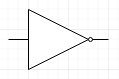

How does a computer work?
-------------------------

  Computers are good at following instructions, but not at reading your mind.

  -- Donald Knuth

The previous chapter was a "hook" in that it attempted to get the reader interested without really going into technical details. This chapter is a bit different. As is characteristic for this book, we won't go very much into specifics but we will cover the essentials about understanding computers as is required for software development.

In order to understand how a computer works, we must first learn a bit about *digital logic*.

The way computers work is mostly defined by physics, and what is possible in electronics. The key is the *transistor*, which is a semiconductor device which makes it possible to construct *logic gates*. Logic gates are physical, very small devices that perform logical operations.

Logic gates take one or more *inputs* and have one or more *outputs*. The inputs and outputs typically are *binary signals*; they're either an electric signal with a low voltage (e.g. 0 volts) or a high voltage (e.g. 3.3 volts). Binary means that there are two possible values, often called 0 (*false*) and 1 (*true*). (One binary digit is also called a *bit*.)

The behaviour of a logic gate can be captured in a *truth table*. Here's the truth table for one of the standard logic gates, the *AND-gate*:

+---+---+---+
| A | B | X |
+===+===+===+
| 0 | 0 | 0 |
+---+---+---+
| 0 | 1 | 0 |
+---+---+---+
| 1 | 0 | 0 |
+---+---+---+
| 1 | 1 | 1 |
+---+---+---+

Here, the inputs are labeled 'A' and 'B'. The output is labeled 'X'. The output is 1 only when both A and B are 1 and 0 otherwise, hence the name AND-gate.

The logic gates can be shown in a diagram as well. Here's what the AND-gate would look like in a diagram:

.. image:: ../material/intro/and.png

Here, the input signals would enter from the left while the output signal would exit to the right.

Another standard logic gate is the *OR-gate*. It has the following truth table:

+---+---+---+
| A | B | X |
+===+===+===+
| 0 | 0 | 0 |
+---+---+---+
| 0 | 1 | 1 |
+---+---+---+
| 1 | 0 | 1 |
+---+---+---+
| 1 | 1 | 1 |
+---+---+---+

The OR-gate outputs 1 when either A or B, or both, have 1. In a diagram it would look like this:

.. image:: ../material/intro/or.png

There's also the *NOT-gate*. It has only one input and one output:

+---+---+
| A | X |
+===+===+
| 0 | 1 |
+---+---+
| 1 | 0 |
+---+---+

It *negates* its input and, in a diagram, would look like this:

These gates are enough to build complex digital devices including computers (though several million of them may be necessary).

Let's say we wanted to put together a circuit with the following truth table:

+---+---+---+
| A | B | X |
+===+===+===+
| 0 | 0 | 0 |
+---+---+---+
| 0 | 1 | 1 |
+---+---+---+
| 1 | 0 | 1 |
+---+---+---+
| 1 | 1 | 0 |
+---+---+---+

That is, it's almost like the OR-gate but if both A and B are 1 then we output 0. (This is also called *XOR-gate*, or exclusive-or.) We could build this circuit by combining what we already have:

.. image:: ../material/intro/xor.png

Let's see what we have here:

* We have one OR-gate (labeled OR), two AND-gates (labeled AND-1 and AND-2) and one NOT-gate (labeled NOT)
* The inputs, A and B, are fed both to the OR-gate and AND-1
* The output of AND-1 is negated
* Finally, the output of the OR-gate and the negated output of AND-1 is combined in AND-2. The output of this gate is the output of our circuit.

What happens here is that the output of the OR-gate is always 1 when one of the inputs is 1.

The output of AND-1 is only 1 when both A and B are 1. However, this output is negated, meaning that the output of NOT is 1 always except when both A and B are 1.

Combining the above in AND-2: When both A and B are 1, the output of NOT is 0, meaning that the output of our circuit is 0. In other cases, the output is the same as the output of the OR-gate. Hence the final output is as desired.

We also have a new building block: whenever we need a XOR-gate, we can use this design.

*Exercise*: Using only the OR-, AND- and NOT-gates, design, with a pen and paper, a circuit with two inputs A and B, and output X, such that the when both A and B are 0, the output is 1. In all other cases the output must be 0.

We can now put together various logical circuits. How about practical use cases?

Addition
========

One of the first professions that computers made unemployed were the *computers*: people who were given arithmetic tasks such as "123,456 + 789,012", with the goal of computing the correct answer. Indeed digital logic can be used for arithmetic. Let's start with addition.

0 + 0 = 0.

0 + 1 = 1.

1 + 0 = 1.

1 + 1 = 2.

Seems simple, doesn't it? Indeed this is quite similar to our OR-gate, except that because our values can only be 0 or 1, we don't have the ability to encode the number 2 in one signal. But we could have another output signal, with the meaning of "the output is two". The truth table for such a circuit would then look like this:

+---+---+-------------+-----+
| A | B | Output is 2 | Sum |
+===+===+=============+=====+
| 0 | 0 |           0 |   0 |
+---+---+-------------+-----+
| 0 | 1 |           0 |   1 |
+---+---+-------------+-----+
| 1 | 0 |           0 |   1 |
+---+---+-------------+-----+
| 1 | 1 |           1 |   0 |
+---+---+-------------+-----+

We could then arrive at the final sum by calculating "output is 2" \* 2 + "sum".

This circuit could be designed e.g. like this:

.. image:: ../material/intro/add2.png

The top gate is a XOR-gate. Hence the "sum" output is A and B XOR'd while the "output is 2" output is A and B AND'd.

What if we wanted to count higher?

2 + 0 = 2.

2 + 1 = 3.

3 + 0 = 3.

3 + 1 = 4.

3 + 2 = 5.

3 + 3 = 6.

We simply add more input and output, and more gates. The truth table could look like this:

+----+----+----+----+-----------+-----------+-----------+
| A1 | A2 | B1 | B2 | Sum has 4 | Sum has 2 | Sum has 1 |
+====+====+====+====+===========+===========+===========+
|  0 |  0 |  0 |  0 |         0 |         0 |         0 |
+----+----+----+----+-----------+-----------+-----------+
|  0 |  0 |  0 |  1 |         0 |         0 |         1 |
+----+----+----+----+-----------+-----------+-----------+
|  0 |  0 |  1 |  0 |         0 |         1 |         0 |
+----+----+----+----+-----------+-----------+-----------+
|  0 |  0 |  1 |  1 |         0 |         1 |         1 |
+----+----+----+----+-----------+-----------+-----------+
|  0 |  1 |  0 |  0 |         0 |         0 |         1 |
+----+----+----+----+-----------+-----------+-----------+
|  0 |  1 |  0 |  1 |         0 |         1 |         0 |
+----+----+----+----+-----------+-----------+-----------+
|  0 |  1 |  1 |  0 |         0 |         1 |         1 |
+----+----+----+----+-----------+-----------+-----------+
|  0 |  1 |  1 |  1 |         1 |         0 |         0 |
+----+----+----+----+-----------+-----------+-----------+
|  1 |  0 |  0 |  0 |         0 |         1 |         0 |
+----+----+----+----+-----------+-----------+-----------+
|  1 |  0 |  0 |  1 |         0 |         1 |         1 |
+----+----+----+----+-----------+-----------+-----------+
|  1 |  0 |  1 |  0 |         1 |         0 |         0 |
+----+----+----+----+-----------+-----------+-----------+
|  1 |  0 |  1 |  1 |         1 |         0 |         1 |
+----+----+----+----+-----------+-----------+-----------+
|  1 |  1 |  0 |  0 |         0 |         1 |         1 |
+----+----+----+----+-----------+-----------+-----------+
|  1 |  1 |  0 |  1 |         1 |         0 |         0 |
+----+----+----+----+-----------+-----------+-----------+
|  1 |  1 |  1 |  0 |         1 |         0 |         1 |
+----+----+----+----+-----------+-----------+-----------+
|  1 |  1 |  1 |  1 |         1 |         1 |         0 |
+----+----+----+----+-----------+-----------+-----------+

Here, our inputs are two bits for each number, and we have three bits of output, to capture all possible outputs. The input for either A or B can be any of 0, 1, 2 or 3. 0 is encoded by the pair of bits 0 and 0. 1 is encoded by 0 and 1. 2 is encoded by 1 and 0. Finally, 3 is encoded by 1 and 1. The final output can be calculated from the three bits of output using the formula "sum has 4" * 4 + "sum has 2" * 2 + "sum has 1".

*Exercise*: Check that the above truth table is correct for some row. Decode what number A, B and output are from the bits.

In similar vein we can do e.g. subtraction and multiplication.

How about comparing whether one number is larger than another one? E.g. for one-bit numbers we'd like the following truth table:

+---+---+---+
| A | B | X |
+===+===+===+
| 0 | 0 | 0 |
+---+---+---+
| 0 | 1 | 0 |
+---+---+---+
| 1 | 0 | 1 |
+---+---+---+
| 1 | 1 | 0 |
+---+---+---+

Here, X is 1 when A is greater than B and 0 otherwise. This, too, can be done using digital circuits.

*Exercise*: Come up with a design for a comparator matching the above truth table.

Now that we're able to construct digital circuits, let's see how they can be used to put together a device with some characteristics not completely unlike those of a smartphone. This is the topic for the next chapter.
