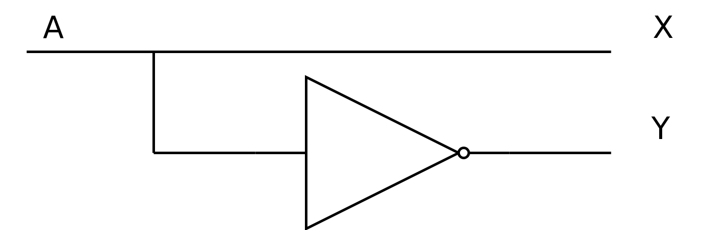

Ok, but seriously, how does a computer work?
--------------------------------------------

Truth table:

+---+---+---+
| A | X | Y |
+===+===+===+
| 0 | 0 | 1 |
+---+---+---+
| 0 | 0 | 1 |
+---+---+---+
| 1 | 1 | 0 |
+---+---+---+
| 1 | 1 | 0 |
+---+---+---+

Design:

