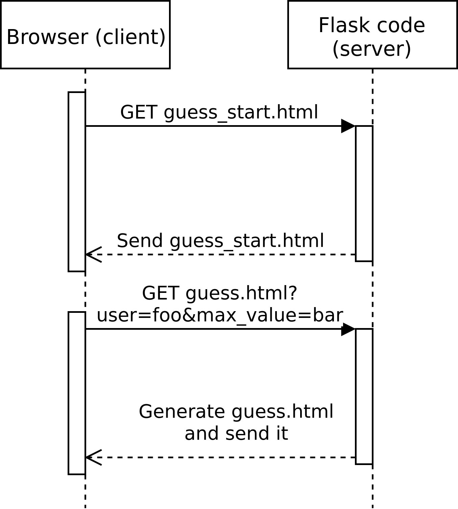

The page for starting a new game
--------------------------------

We should have a "start new game" page for our guessing game. The purpose of this page is to capture the player user name and the maximum number that the computer will think of.

How could we go about this? Let's define the use case first:

1. The user will enter a page where he or she will have to enter a name and a maximum number. The page should have a button "Play" that takes the user to the guessing game.
2. In the guessing game page, the maximum number the computer will think of will need to be determined by what the user entered.
3. Once the user has guessed the correct number, the user name and the maximum number will be stored alongside the number of guesses in the database.

What are the challenges around implementing this? It's often helpful to think about the interfaces, i.e. data exchanges between different components, including pages as well as the server and the client. We should also note that we need a mechanism to transfer the data (user name and maximum number) from the first page to the second. One way to do this is to encode the relevant information in the URL by using the *query string*. This means that the URL for the guessing game could look e.g. like this:

"http://127.0.0.1:8081/guess/?user=Antti&max_value=25"

Here, the part after the question mark ("?") is the query string. It has two parameters, namely "user" and "max_value" with values "Antti" and "25" respectively. *HTML forms* can be used to generate the query string.

Once we have the user name and the maximum value provided to our guessing game, we need to use this information. There are (at least) two possibilities how we could do this:

1. We could modify our server code to generate the guessing game HTML differently based on user input.
2. We could modify our JavaScript code in the guessing game to read the user parameters from the URL, and modify our HTML accordingly.

It doesn't seem to make a huge difference which way we go, but let's pick the first alternative. (The second one involves using regular expressions in JavaScript to parse the parameters from the URL.)

The following sequence diagram illustrates the communication flow.

To break this down in tasks:

1. We need to write the HTML for the "start new game" page. This page should have an HTML form for capturing user input, and pressing the button to submit the form should lead the user to the guessing game page.
2. We need to update our server code to serve the new "start new game" HTML page for some URL.
3. We need to modify our guessing game HTML and JS such that it reads the user name and maximum number from parameters provided by the server code.
4. We need to handle any possible GET parameters in our server code such that they'll be used when generating the guessing game page.
5. We need to modify our code that uploads data in the database to include the user name and the maximum number.

Let's do this then.

HTML forms
==========

HTML forms are a fairly simple way to get simple data from a user. Here's an example:

.. code-block:: html
    :linenos:

    <!DOCTYPE html>
    <html lang="en"> 
        <head> 
            <meta charset="UTF-8">
            <title>Guessing game</title>
        </head> 
        <body> 
            <form action="/guess/" method="get"> 
                What's your name? <input type="text" name="user" value="User">  
                <input type="submit" value="Play!">  
            </form> 
        </body> 
    </html> 

* Line 8: We define the form. It has two attributes: *action* and *method*. Action tells the browser which page should be fetched when the form was submitted. Method tells the browser whether it should GET or POST.
* Line 9: We create a text box with a default value ("User") and name ("user"), the contents of which will be sent to the server. As GET will be used, they will be sent in the URL.
* Line 10: We use the <input> tag to define the button pressing which will submit the form.

*Exercise*: Add this HTML to your templates directory. Add a text box such that the user can also input the maximum number.

*Exercise*: Add a new Flask function to serve your HTML using render_template(). 

Using templates
===============

So what we have now is a page that has a form, which, when filled and submitted, will fetch our guessing game, and send the parameters from the form to the server as part of the URL when fetching the guessing game page. (If you try this out you should see the parameters encoded in the URL.) However, the guessing game page doesn't use the parameters. Let's fix this.

Earlier we decided to handle this using *templates*: Flask provides an easy way to define variables in our HTML files such that the server can *generate* the HTML page differently depending on the parameters. This is documented thoroughly on the Flask web site but let's see how it would look in our URL handler function:

.. code-block:: python
    :linenos:

    @app.route("/guess/", methods=['GET'])
    def guess():
        user = request.args.get('user', 'User')
        return render_template('guess.html', user=user)

What Flask provides us is a globally available object named "request" which contains any GET parameters. We use this on line 3. It has the member variable "args" which has the member function "get" which takes two parameters: the name of the GET parameter, and a default value should the parameter not exist.

On line 4, we pass this parameter to the HTML generation function. In order to use the parameter, we need to modify our HTML file. Check this out:

.. code-block:: html

    

    Hello {{ user }}! This is the guessing game! I'm thinking of a number between 1 and 25, can you guess what it is?
    

Here, we use the parameter "user" using double curly braces ('{{' and '}}'). What happens is Flask will generate HTML based on this template, i.e. replace "{{ user }}" with the value from our Python code, and serve the generated HTML to the browser.

*Exercise*: Handle both user name and maximum number parameters in your Flask code and guessing game HTML. For the maximum number, you can have Flask insert it in your JavaScript code by doing e.g. "var overall_max_value = {{ max_value }};". You can also store the user name as a JavaScript variable for later use.

Uploading more JSON data
========================

Now we should have everything in place such that the maximum number depends on the user input, and the user name is available for our JavaScript. Let's add this information in the database when the user has correctly guessed the number. We should currently have something like this in our JavaScript code:

.. code-block:: js

    xhr.send(JSON.stringify({'my_number': 42}));

...with the number of guesses sent instead of 'my_number'. Can you find out how to add the user name and the maximum number of guesses here?

*Exercise*: Include the user name and the maximum number of guesses in the JSON to be sent to the server.

There's one more step we need to do before the correct data is added in the database. From before we should have a line like this on the Python handler when the correct number is guessed and JS POSTs the result:

.. code-block:: python

    r.lpush("25", json.dumps({'guesses': 42}))

...with the value being a JSON string containing the number of guesses and the current date and time, as a string. Let's improve on this.

*Exercise*: Modify your data insertion code such that the key is the maximum number, and the value JSON includes the user name.

Now we should have almost everything in place, except the user doesn't have visibility over previous scores. Let's fix this in the next section.

