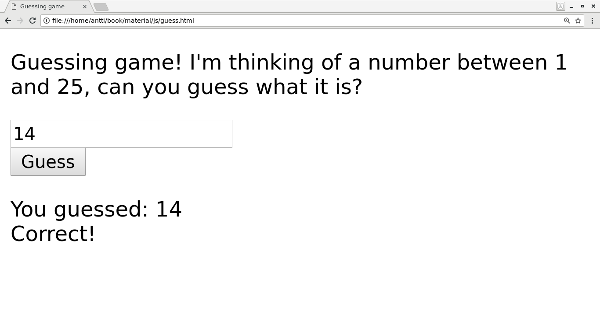

Guessing game in JS
-------------------

Let's write a guessing game. This game is fairly simple: the computer thinks of a number between 1 and 25, and the user needs to guess what it is. The user can make a guess, and depending on the guess, the computer may tell the user either "my number is smaller", "my number is bigger" or "correct number!"

Moreover, let's write this such that it's run in the browser. It should look something like this:

Now, in order to do this we're going to need JavaScript and HTML.

Disclaimer: This book introduces the basics of JavaScript and HTML but does specifically *not* include the modern best practices around web development. There are several reasons for this, one being that the best practices on web development are still under relatively rapid change, but the material in this book should be enough for the reader to gain a high level understanding of JavaScript and HTML and put together some interactive web pages.

The development environment will work like this: create a file with an extension .html and open it in your text editor. After you've made changes to your file, you can open it in your browser. For example, on Linux, if your file is called hello.html, you can open it in Firefox by running "firefox hello.html" in your terminal. When you make changes to the file, refresh the tab in your browser. If you're running some other system you'll need to find out how to open a local HTML file. On some systems, e.g. Linux, you can use the "file://" scheme, such that e.g. "file:///home/antti/hello.html" would be the URL to an HTML file in the user's directory.

What happens here is that the browser will read in the contents of your file and interpret it. The browser has an engine for reading and rendering HTML, such that if you for example describe, in your HTML, that a part of text should be displayed red, the browser will know to render that text red. Similarly the browser has a JavaScript interpreter built in, and will execute the JavaScript code embedded in the HTML file.

Let's start breaking down this task by creating the most basic HTML and JavaScript. Here's an HTML file:

.. literalinclude:: ../material/js/js1.html
   :language: html
   :linenos:

You can type this code into a file and open it in your browser. You should see a plain web page with a text "some text". Some lines of the code aren't important to us right now but let's go through some of it:

* Line 2: we open the "html" *tag*. This is closed on line 10.
* Lines 3-6 are our "head" section which includes, among others, the title for our page
* Lines 7-9 are our "body" section
* Line 8 is our paragraph (denoted with "
"). This paragraph has the text "some text".

Here's one of the most basic "programs" that utilises JS and HTML:

.. literalinclude:: ../material/js/js2.html
   :language: html
   :linenos:

Let's go through this in detail:

* Lines 6-10: We've introduced a new section within our "head" section: the "script" section which holds our JavaScript code.
* Line 14: We've added an *id* to our paragraph (simply named "paragraph").
* Line 15: We've added a *button* using the tag "<input>" with an attribute 'type="button"'. The button has a text "Press me". Once pressed, it will call the *JavaScript function* "myfunc".

Our JavaScript code consists of one function definition. The JavaScript function "myfunc" has one line: it retrieves the element "paragraph" from the page, and changes its member variable "innerHTML" value to "new text". The element "paragraph" is our paragraph, and its member variable "innerHTML" is the text within that paragraph. Hence, the JavaScript function changes the contents of the paragraph.

If you run this in your browser, you should see a text "old text" and a button. If you press the button, the text is replaced with "new text".

What happens here is that the paragraph has an ID, and the button has a JavaScript function associated with it. When pressing the button, the browser executes the JavaScript code which changes the text.

To be clear, with JavaScript we can change the HTML, i.e. what the user sees, based on logic (code). Our JavaScript code can *read* user input by reading the values stored in the *Document Object Model* (DOM), e.g. by reading the variable of a text field using document.getElementById("guess").value. Similarly our JavaScript code can *write* to the DOM, i.e. modify what the user sees e.g. by changing the value of a variable such as document.getElementById("paragraph").innerHTML. By reading user input from DOM and making changes to DOM, we can build interactive web pages.

In general, HTML describes the content, i.e. what is shown to the user, while JavaScript describes the logic, i.e. what happens.

Let's put together one more example to capture the other bits and pieces we need for our game:

.. literalinclude:: ../material/js/js3.html
   :language: html
   :linenos:

The code in this example isn't very useful as a whole but includes different snippets which are needed for our guessing game:

* Line 7: The function Math.random() is called which returns a random floating point number between 0 and 1. This is furthermore multiplied by 20 to get a number between 0 and 20. This line also demonstrates use of variables in JavaScript. The variable is defined outside the function, such that the random number is only generated once, at page load.
* Line 8: The function Math.floor() is called to round the number down to an integer. The result is a number between 0 and 19.
* Line 11: Different strings and variables can be *concatenated*, or put together, using the "+" operator.
* Lines 12-18: JavaScript also supports branches.
* Line 19: We can obtain the value of an element in DOM and store it in a variable. We can append to an existing string using the "+=" operator.
* Line 22: In HTML, we can use the "<input>" tag with attribute 'type="text"' to create a *text box*. The user can type text in it. We read the contents of this text box in our JavaScript code on line 14.

*Exercise*: What does the above page do? Try it out. Try reloading the page.

Now we have everything we need to put our game together. What we'll need is:

1) Some JS logic to generate the random number which is the number the computer "thinks" of, and which the user is expected to guess. Note that you'll need to have this code *outside* any of your functions, such that the number is generated only once per page load.
2) A text field where to input what the guess is
3) A button indicating we'd like to make a guess
4) More JS logic to check the guess against the number the computer is thinking of
5) Changing the text in the paragraph to indicate whether our guess is correct, too low, or too high

You may need to debug JavaScript, for example if you make a typo, causing your program to not run correctly. How to debug JavaScript depends on your browser. For example with Chrome, you can hit F12 to bring up the developer information panel. This shows any JavaScript errors, for example.

*Exercise*: Implement the guessing game where the computer thinks of a number and the player needs to guess which number it is. The JavaScript code should give hints to the player whether the guess is too small, too large, or correct.

*Exercise*: Have the program count the number of guesses, and display the total number at the end.
