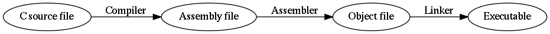
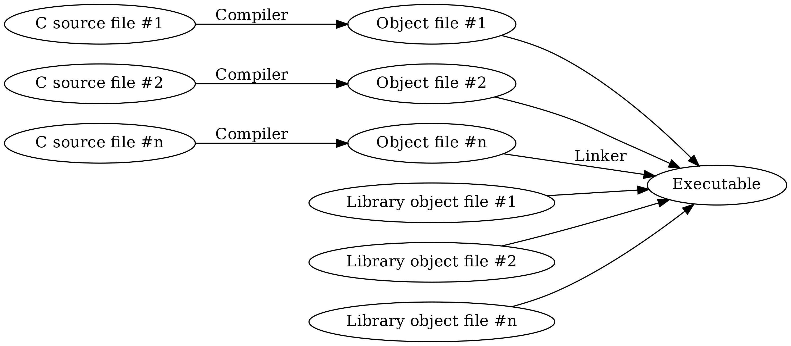

Setting up the C toolchain
--------------------------

  C is quirky, flawed, and an enormous success.

  -- Dennis Ritchie

In the previous chapters we learnt some basic programming using Python. In order to get a better understanding of what is general in programming and what is specific to a programming language, we'll learn some basic programming using another programming language, namely C.

We'll start by setting up the C *toolchain*. A toolchain is a set of tools that are used in a chain with the purpose of compiling and running code written in a specific programming language. As you may have noticed, with Python, we executed our Python programs by passing our Python file to the Python interpreter. What happened there, in a nutshell, was that the Python interpreter *interpreted* our code, i.e. read it through and then executed it. C is typically not interpreted but *compiled*. What this means is that the C code is run through a *compiler* which generates an *executable file*, that is, a file with the CPU instructions which the CPU should execute. Only after we've created this executable file we can run it which in turn runs our program. (The Python intepreter is an executable. The official Python interpreter is written in C.)

Now, the C toolchain is a toolchain because in addition to the compiler, you also need the *standard library* which contains the implementations of standard functions in binary form (CPU instructions), the *assembler*, because technically the compiler outputs *assembly language*, which is a human readable format for the CPU instructions which is converted to the actual binary CPU instructions by the assembler (also called the *object file*), and finally the *linker* which links the standard library, our object files and possibly other libraries together to form the final executable. In short, the toolchain looks like this:

...however, modern C toolchains typically combine all of it in one Unix command so you can usually go from the C source file to the executable in one step. Because of this, in this chapter from now on, the terms "compiler" and "toolchain" are used interexchangeably.

Things do look a bit different if you have several C source files and libraries, namely like this:

Here, the compiler needs to be called multiple times. But our programs will be one file only, at least for now.

Writing "Hello world" in C
==========================

Here's the "Hello world" program in C:

.. code-block:: c
    :linenos:

    #include <stdio.h>

    int main(void)
    {
        printf("Hello world\n");
    }

Let's go through this line by line:

* Line 1: We *include* the *header file* called "stdio.h" (standard input and output). The angle brackets ("<" and ">") indicate this header file is expected to be part of the system (as opposed to something we wrote ourselves). Including a file using "#include" causes the *preprocessor* (which is a part of the compiler) to simply include all the contents of that file during compilation. Header file is typically a file that includes *function declarations* of functions that are located in a library; including the relevant header file is recommended when functions of a library are used. In our case, we want to use the *printf* function which outputs text and is part of the C standard library.
* Lines 3-6: We *define* the function called "main". Every C program must have exactly one function called "main" which is the entry point to the program, i.e. the start of the program execution. The keyword "int" means our "main" function returns an integer (as is mandated by the standard) but this isn't relevant for us now. The keyword "void" means our function doesn't receive any parameters. We must start and end the function definition with curly brackets ("{" and "}").
* Line 5: We call the function printf(). We pass it one parameter, namely the *string* "Hello world\\n". This causes the function to print the text "Hello world" followed by a *newline character*, a special character that corresponds to enter, or line feed. We must enter the semicolon (";") after the function call to denote the end of the *statement*.

*Exercise*: Type (don't copy-paste) the above program to a file. Call the file "hello.c".

Installing a C compiler
=======================

Let's now ensure we have a C compiler (which in our case includes the assembler, the linker and the standard library) installed.

You may already have one installed. The most common C compilers at the time of writing in Unix systems are *gcc* and *clang*. For now it's not relevant which one you use. You can test if you have gcc installed by running e.g. the following:

.. code-block:: bash

    $ gcc -o hello hello.c

If you get no output, then you have gcc installed. You should then have the file "hello" in the current working directory. This is our binary file.

You can also try if you have clang installed using e.g. the following:

.. code-block:: bash

    $ clang -o hello hello.c

Again, no output implies clang having successfully run and compiled the program. For both compilers we passed the *command line flag* "-o" which makes it possible for us to define the output file, which we define in the following parameter to be "hello". The last parameter to the compiler is the input C source file.

If you have neither gcc nor clang installed, please install one of them. Again, I cannot tell you how as it is platform dependent; please perform the relevant online searches as necessary.

Once you have been able to compile the "Hello world" program successfully, you can then run the resulting binary file with the following:

.. code-block:: bash

    $ ./hello
    Hello world!

Here, the prefix "./" means we want to run an executable file in the current directory. As we see, the output is what we passed to printf().

*Exercise*: Compile and run the "Hello world" program.

*Exercise*: Remove the characters "\\n" from the parameter to printf(). Compile and run again. What changed?

