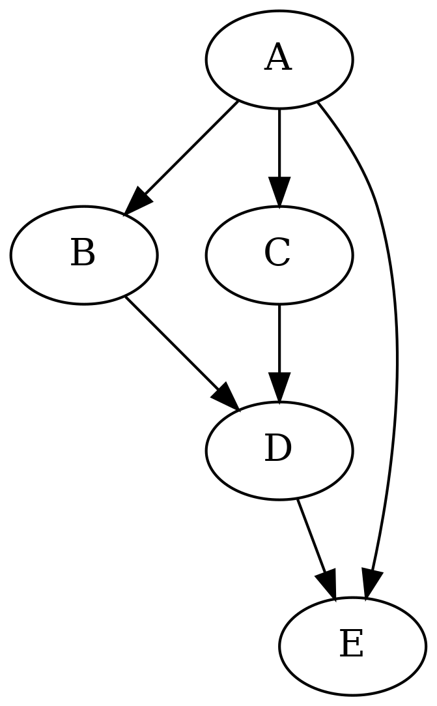

Graphs
------

In this section we'll learn a bit about *graphs*.

A graph is a collection of *nodes* as well as *edges* that connect nodes. There are lots of different kinds of graphs:

* The nodes or edges may have *labels*
* The edges may be *directional* (bidirectional or unidirectional)
* The edges may have a *cost* associated with them

As with the other topics in this book, we only treat graphs in a shallow way. Namely to solve a very precise problem.

Here's an example graph:

.. image:: ../material/dot/dependencies2.png

It's a graph showing the dependencies between the toplevel chapters of this book. For example, the chapter "Unix shell" has "Introduction" as its dependency.

(Apart from describing dependencies between chapters, graphs can be used for describing other kinds of dependencies like in a supply chain. They can also be used to describe other relationships like distances or routes between places, relationships between people etc.)

Now, here's the problem with this graph: it has too many edges. You see, the code that creates the edges for this graph isn't very smart, so it includes some edges that strictly speaking don't need to be there. For example, you see the edge from "Introduction" to "Javascript"? As "Javascript" already depends on "Unix shell" which depends on "Introduction", there's no need to have an edge from "Introduction" to "Javascript". This edge can and should be removed.

We have two parts to this problem: one is finding the algorithm that does what we want it to do, i.e. remove the edges, and the other is putting this algorithm into use to actually generate a graph with unnecessary edges removed.

Can you think of how the algorithm to remove unnecessary edges would work?

One way to think of it is that an edge from A to C should be removed if we find an edge from B to C, where B is dependent on A, either directly or indirectly. That way we "only" need to keep track of which nodes are dependent on which. In pseudocode this could look something like this:

.. code-block:: python

    for node in nodes:
        for direct_child in node.get_direct_child_nodes():
            for other_child in node.get_direct_child_nodes():
                if other_child.depends_on(direct_child):
                    node.remove_edge(other_child)

It's probably a good idea to draw the above on paper to get an understanding of how it would work.

Now that we have a very rough description of an algorithm in place, we can consider the question about how we actually would create or modify a graph.

Graphviz and dot
================

Graphviz is a software suite for working with graphs. Dot is a program which is part of graphviz that produces images of graphs specified in the *dot* language. Here's an example graph described in the dot language:

.. literalinclude:: ../material/dot/graph.dot

This file can be fed to the dot program, e.g. like this:

.. code-block:: bash

    $ dot -Tpng < graph.dot > graph.png

As you can see, dot takes the output format as a parameter, can read dot files from stdin and output to stdout. The result could look like this:

(The edge from A to E is unnecessary.)

*Exercise*: Install the graphviz suite on your computer. Run the above dot command to make sure you have everything set up correctly. Bonus points if you compile it from source.

As you can see, the dot language is fairly simple, at least in this case, and fairly intuitive.

Here's a bit more complex example of a dot file - it's the source for the graph at the beginning of this section:

.. literalinclude:: ../material/dot/dep2.dot

The main difference, apart from having more nodes and edges, is that the nodes have *IDs* associated with them, and each ID has *a label*. This way, the lengthy name that will be displayed for each node is only written once in the dot file, even when a node is referenced multiple times.

Now, what we could do is read in a dot file, *parse* it i.e. understand its contents and store a representation of it in a variable, modify the data structures representing the graph to remove edges we don't want, and finally write out a new dot file with the edges removed which can then be fed to dot for generating a better graph. Sounds good?

How would you go about this problem in practice? Go ahead and give it a try using the dot file from above. The next section will walk you through solving this.

Parsing dot files
=================

There are several ways to approach parsing dot files. We'll introduce and implement two ways as part of this book: the *hacky* way and the *more accurate* way. Here are the pros and cons:

* The "hacky" way is faster to implement
* However, the "hacky" way is designed to only work with dot files that are structurally very similar to the ones above; adding support for more dot features will be very difficult

Conversely, the more accurate way is somewhat more difficult to implement but is closer to a "real" dot parser, such that extending it later will result in more maintainable code. In our case, the hacky way results in about 30 lines of Python code while the more accurate way will be about 150 lines. These numbers include not only parsing but also applying the algorithm to remove unnecessary edges.

The hacky way
=============

The hacky way involves heavy use of regular expressions.

The principle is simple: 

* For each line, see if it matches a pattern "(word) -> (word);"
* If not, print out the line (remember, we wanted to end up printing a dot file with the unnecessary edges removed), unless the line is simply a '}' which denotes the end of the dot file
* If it does, note the two words as a link (key and value in a dictionary)
  
After this, we'd end up with a dictionary describing all the links. The key of the dictionary would be a string while the value would be a list of strings, i.e. all the edges from a node.

.. topic:: collections.defaultdict

  collections.defaultdict is a handy little Python library that can be helpful when creating dictionaries. Without it, the code to append an element to a list which is the value in a dictionary would look e.g. like this:

  .. code-block:: python

      my_dict = dict()
      key = 'foo'
      value = 'bar'
      try:
          my_dict[key].append(value)
      except KeyError: # key not in dict
          my_dict[key] = list()
          my_dict[key].append(value)

  What this code does is add a value to a list in a dictionary, unless the list doesn't exist yet in which case it needs to be created first. collections.defaultdict simplifies this code:

  .. code-block:: python

      import collections

      my_dict = collections.defaultdict(list)

      key = 'foo'
      value = 'bar'
      my_dict[key].append(value) # will automatically create a new list when needed

.. topic:: Regular expressions in Python

  In Python, you can check if a regular expression matches a string by using e.g.:

  .. code-block:: python

     import re

     regex = re.compile('[0-9]+')
     s = '123'
     result = re.match(regex, s)
     if result:
         print '"s" is a number'

  You can also *capture* what was matched with parentheses, e.g.:

  .. code-block:: python

     import re

     regex = re.compile('[a-z]*([0-9]+)[a-z]*([0-9]+)'))
     s = 'abc123def456'
     result = re.match(regex, s)
     if result:
         print 'The number within "s" is:       ', result.group(1)
         print 'The number at the end of "s" is:', result.group(2)

  Here, you can define which captured string you want via the parameter to group().

After this "parsing", we can do the following:

* Apply our algorithm to remove unnecessary edges - that is, remove the unnecessary entries in our dictionary
* Write out all the edges by simply printing "    %s -> %s;" % (word1, word2)
* Print '}' to close the dot file description

That's it, really.

*Exercise*: Implement this hacky method to "parse" a dot file. You don't need to remove the unnecessary edges yet. Write the output of your program to a file and diff against the original. They should match except possibly for line ordering and whitespace. You can sort the lines in both files alphabetically using the "sort" Unix command for easier comparison. Feel free to reach out to a reference on regular expressions if needed.

Removing unnecessary edges
==========================

This process, after searching online, reveals to be called *transitive reduction*.

*Exercise*: look up transitive reduction online.

We already roughly described an algorithm to remove unnecessary edges in pseudocode. Let's see what we need to do in order to turn it into real code:

* We need to be able to get a list of the direct child nodes of a node. Our dictionary we put together above works well here.
* We need to be able to remove the edge between a node and a child node. Again, this is something we should be able to do with our dictionary (with e.g. my_dict[key].remove(node)).
* We need to be able to tell if node A is either a direct or an indirect child node of node B, i.e. whether node B depends on node A. We don't have this yet.

Let's implement this algorithm: we need to *traverse* the graph to be able to tell whether a node depends on another. There are two major kinds of graph traverals, *depth first search* and *breadth first search*. In this case it doesn't matter which one we pick.

Graph traversal
===============

Let's take a look at the simpler graph from before again:

If we were to start our traversal from node A, the depth first traversal, which, as the name says, goes into depth when traversing, would traverse the nodes e.g. in the following order:

A -> B -> D -> E -> C

This is because depth first traversal traverses along the edges of the last visited node first. In other words, depth first traversal maintains a *stack*, such that any edges from newly visited nodes are added at the top of the stack.

If we were to traverse from node B using breadth first traversal, the order would e.g. be the following:

A -> B -> C -> E -> D

This is because breadth first traversal traverses along the edges of the first visited node first. In other words, breadth first traversal maintains a *queue*, such that any edges from newly visited nodes are added at the end of the queue.

In Python, a simple list can function either as a stack or a queue, with the pop() member function being able to return (and remove) either the first or the last element of the list, and the insert() and append() functions being able to add elements either the beginning or the end of the list, though Python also has more specific data structures that can be used such as collections.deque.

Finding out whether node B is either directly or indirectly dependent of node A is then a matter of traversing the graph from node A. If node B is encountered, it depends on node A.

*Exercise*: Using your dictionary describing the dependencies in a dot graph, write a traversal function to check if a node is a child node of another. You can use either depth first or breadth first search.

You may recall that function calls are also stored in a stack, such that the computer (or virtual machine) knows where to jump to after a function has finished. This correctly implies that we can implement the depth first search recursively, i.e. instead of having our explicit stack we simply call a recursive function that does the search for us.

*Exercise*: Implement depth first search using recursion.

We should now have all the pieces we need to finish our program.

*Exercise*: Finish the program to remove unnecessary edges. See the pseudocode above for the principle. Use your traversal function to determine whether a node depends on another.

By the way, the Graphviz suite also includes a tool called "tred" which performs transitive reduction similarly to our code. You can also use this to validate the output of your program.

*Exercise*: Look up the source code for "tred" in the Graphviz source.
