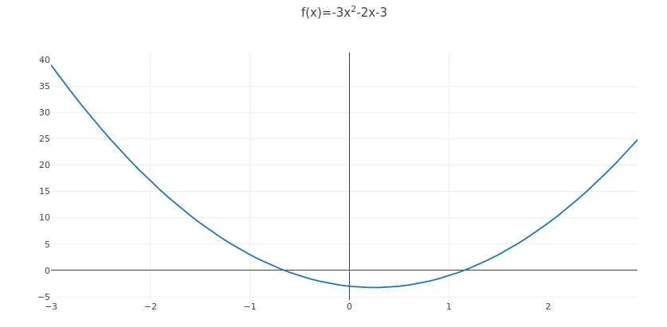
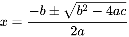

Quadratic formula in C
----------------------

Now that we're able to create some C programs, let's try a bit more complicated one. Let's write a program to solve a quadratic equation.

As you may know, a quadratic equation is an equation ax\ :sup:`2`\ +bx+c=0, whereby a, b and c are constants. A quadratic function, when plotted, may look e.g. like this:

Solving the quadratic equation provides the *roots* of the equation, i.e. the x values at which the x-axis is crossed. For the above function, the roots are at points x=-0.72 and x=1.39. There may be 0, 1 or 2 roots, and the formula to solve the quadratic equation is:

This mathematical formula can be implemented in C. For example like this:

.. code-block:: c

    x = (-b + sqrt(b * b - 4.0f * a * c)) / (2.0f * a);

The +/- part of the formula causes up to two possible solutions for x to be available; the above C formulation only identifies one.

There may be 0, 1 or 2 roots; the case of 0 roots occurs when the part for which the square root is calculated (also called the *determinant*) is negative, as a negative number cannot have a real square root. The case of 1 root occurs when the determinant is exactly 0.

The C function sqrt() is part of the standard C library but there's a twist: in order to use the function, the header file <math.h> should be included. Furthermore, you may need to link your program against the *math library* by passing "-lm" to your C compiler when compiling.

*Exercise*: Write a program that solves the quadratic equation for a=3.0, b=-2.0, c=-3.0. Print out the number of roots as well as all found roots.

Ok, so we now have a program that solves the quadratic equation for some values. What if I asked you to solve the quadratic equation for three, or ten, different functions (a, b and c values), in the same program? There are several ways to approach this but one thing we should avoid is copy-pasting the code to solve the equation multiple times. Instead we should capture this logic in a *function*.

What we require is a function which takes a, b and c as input parameters and returns the roots, as well as an indication as to how many roots were found. Once we have this function we can then call it with different parameters and write out the information about the roots after each call.

Now, there are a few ways this could be approached. An interesting limitation we arrive at is that C can only return one value in a function. However, we can still write our function by using *pointers*.

Pointers
========

Every variable in C has an *address* in memory. Speaking in metaphors, if a variable was a house, then the value of the variable would be the contents of the house, and the memory address would be the address of the house. A pointer in C is a variable for which the value can be the address of another variable.

Here's an example:

.. literalinclude:: ../material/quad/pointer.c
    :language: c
    :linenos:

* Line 5: We define an integer variable called "a".
* Line 6: We define a variable called "p" which is a pointer to an integer. The asterisk ("\*") means the type is a pointer.
* Line 7: We assign a value to "p", namely *the address of* a. The ampersand ("&") means "address of".
* Line 8: We assign a value to *what "p" points to*. The asterisk operator ("\*") means *dereferencing* the pointer.
* Lines 9-11: We print out the values of "a", "p" and "\*p".

*Exercise*: What would you expect the output to be? Try it out.

In this example, using the pointer wasn't necessary because if we wanted to change the value of "a", we could have done it directly. However, if you want to change the value of a variable of another function then pointers become useful. What you can do is pass the address of a variable to the other function. The other function can then modify the value of that variable. In this way we can "return" multiple values from a single function.

The following example illustrates the principle:

.. literalinclude:: ../material/quad/pointer2.c
    :language: c
    :linenos:

* Lines 3-7: We define a function called "increment_by_one" which doesn't have a return value and takes two input parameters. Both input parameters are pointers to int.
* Line 5: We assign the value of what "p1" points to plus one to what "p1" points to.
* Line 6: The same for "p2".
* Lines 11-13: In our main function, we define two int variables, and pass the addresses of these to the "increment_by_one" function.

Here, we have a function that takes two pointers and increments the values of the variables that are pointed to by one.

We should now have what we need to create a function that solves the quadratic equation.

*Exercise*: Write such a function. It should have parameters a, b and c (all floats) as well as r1 and r2 (pointers to floats). It should return an int which is the number of roots found for the given function. In other words, its function *signature* should be e.g. "int quad(float a, float b, float c, float \*r1, float \*r2)". In your main function, define the variables a, b, c, r1, r2 and number_of_roots. Set the variables such that you can solve the quadratic equation for a=3.0, b=-2.0, c=-3.0. Print out the roots found. Only call printf() within main.

*Exercise*: Modify your code to solve the quadratic equation for a=3.0, b=-2.0, c=3.0 (positive c instead of negative). This equation has no roots. What happens if you print out the values of r1 and r2?

Now that we have a function that can solve the quadratic equation, we should try solving several equations and outputting the results. For the next exercise, let's assume our goal is to provide the roots for three different quadratic equations, namely:

* x\ :sup:`2`\ -2x-3
* -x\ :sup:`2`\ -x-1
* 2x\ :sup:`2`\ +2x+0.5

How should we structure the code for this? We should keep our solver function clean of side effects by not using printf() in it. Indeed, the ideal main function for this task could look like this:

.. code-block:: c

    int main(void)
    {
        solve_and_print(1.0f, -2.0f, -3.0f);
        solve_and_print(-1.0f, -1.0f, -1.0f);
        solve_and_print(2.0f, 2.0f, 0.5f);
    }

In other words, for each of the functions to find the roots for, we call a function which does the solving and the printing. We already have a function that can solve the equation so what's left to implement is capturing the behaviour of using the solver function and printing the results.

*Exercise*: Write a program that solves the quadratic equation for the three functions listed above, and prints the results. Your main function should look like the one above. The function solve_and_print() should take three parameters, a, b and c, call the solver function and print the results of the solver function.

