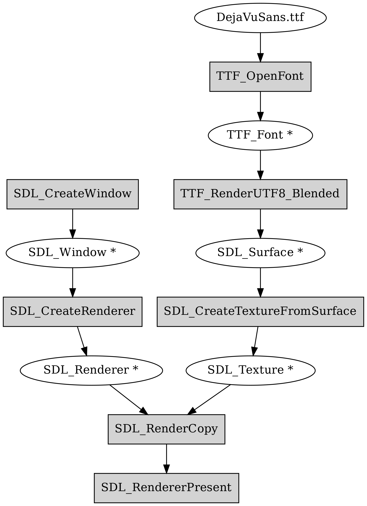

Drawing to a screen using SDL2
------------------------------

Let's tackle the problem of drawing something on the screen.

The requirement is that an image will be drawn on the screen at the bus stop, which is running an embedded CPU with Linux, with the screen being driven by fbdev (framebuffer device). We don't have to care about these details because we don't have the actual hardware available so we'll have to simulate it. What one can do in this case is write an application that can be run on a desktop computer (or some other device that's easily available), but make it configurable or portable such that if the same code was compiled for the system running at the bus stop, it would use the relevant system interfaces to display the information on the bus stop screen instead. When running the code on our development computer we'll simply create a window and draw in it instead.

Now, depending on the OS you're using (Linux, Mac, Windows), the interface to create a window and draw something on it is different. We'll skip this platform specific bit and instead use a library called *SDL2*, or *Simple DirectMedia Layer 2*, which is a relatively thin library providing one interface for all our window handling and drawing needs. Although SDL2 is common among game developers, it's also fairly widely used with embedded software.

What SDL2 does, in a nutshell, is provide functions that do something like this:

.. code-block:: c

    void SDL_CreateWindow(int width, int height)
    {
    #ifdef _WIN32
        /* Windows specific API calls are here */
    #elif __linux__
        /* Linux specific API calls are here */
    #elif __APPLE__
    #ifdef TARGET_OS_MAC
        /* Mac OS specific API calls are here */
    #elif TARGET_OS_IPHONE
        /* iPhone specific API calls are here */
    #else
    #error Unknown Apple target
    #endif /* __APPLE__ */
    #else
    #error Unknown platform
    #endif

What this exemplifies is the use of the C preprocessor to define what code to compile. The C compiler typically defines the platform specific defines automatically, but it's also possible to set defines either in source code or in the compiler command line. Long story short, the people behind SDL have taken care of this such that we won't have to, and can simply call the SDL functions. As a bonus, SDL supports Linux fbdev as well (which is a rather primitive interface for displaying graphics on Linux but popular on embedded systems) so our software could theoretically actually work on a bus stop.

*Exercise*: SDL2 can be downloaded online although your OS may also provide it. In either case, install SDL2 on your computer. One way to do this is to download the source code, extract it and compile it using "./configure && make". You can check out the file INSTALL.txt for more details. The author used SDL2 version 2.0.8.

Although SDL2 is a C library (and hence can be used from C++ directly), many *bindings* to it exist from other language. A binding is a simple wrapper that allows using a library written in one language from another language. E.g. Java bindings for SDL2 exist; this means that there is a Java library available which does nothing more but calls the C SDL2 functions, allowing the use of SDL2 from Java. Typically programming languages only have built in support for calling C functions. This means that if a library was written in e.g. Java and one wanted to call it from Go, this might not be easily possible without first writing a wrapper of the library in C and then calling the C library from Go. The takeaway is that our bus stop program could be written in e.g. Java if we wanted to.

Hello world in SDL2
===================

.. literalinclude:: ../material/bus/sdl_hw.cpp
    :language: cpp
    :linenos:

The above program should, when run, create a window with black contents, display it for three seconds, then terminate. It's a test case to ensure the library can be used.

Let's go through this line by line:

* Line 3: We include the header for the SDL library. This ensures we have the relevant SDL functions declared.
* Line 7: We initialise SDL, asking for support to video (i.e. drawing to a screen). We check the return value. If it's unequal to 0, we terminate.
* Lines 11-15: We create a window of size 640x480 with title "My application".
* Line 20: We create a renderer, i.e. something that can draw something to a window. We ask SDL to create a *software* renderer, i.e. something that doesn't use hardware acceleration (GPU) for drawing to the screen.
* Line 26: We set the colour to be used for clearing the screen to be black.
* Line 27: We ask the renderer to clear the screen.
* Line 28: We ask the renderer to *present* the contents. How rendering typically works is that all pixel colours are first set in a memory buffer, and presenting the contents actually interacts with the OS API to draw something on the actual screen. Hence, clearing the screen on line 27 effectively set the contents on the memory buffer.
* Line 29: We pause the execution for three seconds.
* Lines 31-33: We clean up and exit.

Now, let's try to compile and run this application to ensure we're able to use the SDL2 library.

E.g. on Linux, if you have the library installed via package manager, this command should compile the code:

.. code:: bash

    g++ -Wall $(sdl2-config --cflags --libs) -o main sdl_hw.cpp
    
Here, $(sdl2-config ...) is a *shell expansion*, i.e. it executes the command within the parenthesis and includes the output in the command line. The contents typically are something along the lines of "-I/usr/include/SDL2 -D_REENTRANT -L/usr/lib -lSDL2". This means:

* -I/usr/include/SDL2: Include the path /usr/include/SDL2 in the path where to search for header files. In other words, when compiling, because we had the line #include "SDL.h" in our source code, the file SDL.h should be found somewhere during compilation. We can point to the directory where SDL.h can be found by using the -I switch.
* -L/usr/lib: Include the path /usr/lib in the path where to search for library files. In other words, when compiling, because we call functions such as SDL_Init(), the function should be compiled somewhere so our program can call it. We can point to the directory where the library containing the compiled code is by using the -L switch.
* -lSDL2. *Link* against the library SDL2. In other words, when linking our program to create the final executable, because we call functions such as SDL_Init(), the compiler needs to know which file includes the compiled functions. On Linux, with the combination of the -L/usr/lib flag above, we tell the compiler that we expect the library to be found at /usr/lib/libSDL2.so.

If we compiled the SDL2 source code ourselves but didn't install it on the system, we could compile the code e.g. using this command:

.. code:: bash

    g++ -Wall -ISDL2-2.0.8/include -D_REENTRANT -LSDL2-2.0.8/build/.libs -lSDL2 -o main sdl_hw.cpp 
 
This basically does the same thing but tells the compiler to look for the header and library files in local directories instead of the system directories.

*Exercise*: Compile and run the above program. Try changing the clear colour and running again.

Now, you may wonder what all is there that SDL provides, and what are all the different parameters that the different functions can accept. This is a very valid question and is answered in the SDL *reference*.

*Exercise*: Look up the SDL documentation for the functions SDL_Init and SDL_CreateRenderer. If you're curious, you can also try to find the definitions of the functions in the SDL source code.

SDL and font handling
=====================

Now, what we want is display text on a screen using SDL. As nothing is ever as simple as you'd think when programming, SDL doesn't provide drawing text out of the box, but instead there's another library called SDL2_TTF which provides this functionality. How this works in a nutshell is that you initialise SDL2_TTF, then load a font from a .ttf file (the DejaVu Sans font that was referenced in the introduction), then use that font to create an SDL surface which we then convert to an SDL texture which we copy to the screen buffer using the renderer, finally showing the text on the screen when we present the buffer. Confused yet? The following diagram illustrates the data flow.

The good news is that we only need to implement this once.

*Exercise*: Install the SDL2_TTF library. As before, you may either install it using your OS or compile it from source.

*Exercise*: Look up the documentation for the functions TTF_OpenFont() and TTF_RenderUTF8_Blended().

Here's some code to demonstrate usage of SDL2_TTF together with the SDL2 renderer to draw some text.

.. literalinclude:: ../material/bus/sdl_ttf.cpp
    :language: cpp
    :linenos:

This code is unfortunately missing some key SDL2 calls. If it was complete, you could compile it with the same command as you compile the previous example, but with the added switch "-LSDL2_ttf" to also link against the SDL2_ttf library containing the TTF_* functions.

*Exercise*: Fix the TODOs to get a program that displays some text on the screen. It should display "Hello world" in the top left corner. Note that as the example code is, it will search for the font in the current working directory, i.e. where your shell is when you run the program. Make sure your font file can be found.

Now, provided we had the text labels for our bus stop, we should be able to actually display a window that meets the requirements. What we'll do in this chapter is that we'll have this bit of C++ code which is shared by both implementations of our software; our software following the Unix philosophy will create a text file with the labels which is read by the C++ code to display the correct window while our monolithic C++ application will take the labels as a function parameter and display them. In either case, the SDL code stays the same so we only need to implement that part once.
