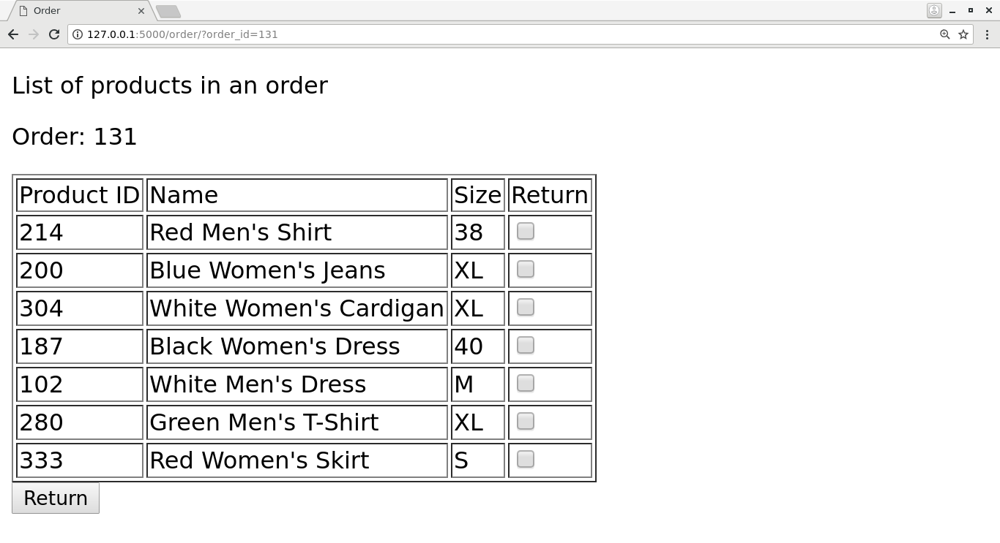
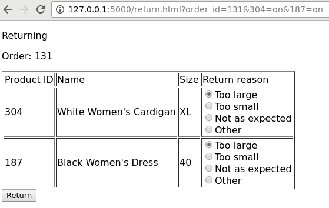

Web UI for our return form
--------------------------

Let's finish this chapter by putting together a simple (but ugly) web UI that allows a user to generate a return form.

We'll be using Flask for this exercise, and to keep things simple, we'll skip the Javascript bit and *generate* all HTML on the server side. Flask makes this fairly easy as it integrates with the Jinja 2 templating language.

Products
========

To start things off, as an example, let's see how we could generate and display an HTML table consisting of Python data. Here's the relevant Python snippet:

.. code-block:: python

    from flask import Flask, render_template, request, make_response
    app = Flask(__name__)

    @app.route("/products/", methods=['GET'])
    def products():
        my_list = [{'a': 1, 'b': 2}, {'a': 3, 'b': 4}]
        return render_template('products.html', my_list=my_list)

This references the file "products.html" which Flask will look for in the "templates" directory. This could look e.g. like the following:

.. code-block:: html

    <!DOCTYPE html>
    <html lang="en"> 
        <head>
            <meta charset="UTF-8">
            <meta name="viewport" content="width=device-width">
            <title>Products</title>
        </head>
        <body> 
            

            List of all products
            

            <table border="1">
                <tr>
                    <td>a</td>
                    <td>b</td>
                </tr>
                
                <tr>
                    <td>{{ elem.a }}</td>
                    <td>{{ elem.b }}</td>
                </tr>
                
            </table>
        </body> 
    </html> 

This makes use of the Jinja 2 *for* statement which will loop through a list provided to the template. In this case, it'll access the dictionary keys "a" and "b" of the input list and display the numbers 1, 2, 3 and 4 in the table.

You can include your SQLite database in your Flask application by calling the relevant functions at the top level, e.g.:

.. code-block:: python

    from flask import Flask, render_template, request, make_response
    app = Flask(__name__)

    import sqlite3

    db = sqlite3.connect('mydb')
    cursor = db.cursor()

    # the rest of the code goes here

*Exercise*: Create the "products" page. Query your database for the products. Turn the result to a dictionary, write an HTML template and pass your data to your template. The page should display all the columns for all your products.

Orders
======

Now, it would be nice to be able to see all the orders by a customer. It would be nice to be able to write a URL like e.g. "http://127.0.0.1:5000/orders?customer_id=123" and get an overview of the orders made by customer 123. Let's do this next.

The part in the URL after the "?" is the query string and is accessible in Flask using the function "request.args.get()". In our case, the following line is what we need:

.. code-block:: python

    customer_id = request.args.get('customer_id', 1) # default to 1 if not given

*Exercise*: Create the Python handler for displaying the orders of a customer. Perform the relevant SQL query. Write an HTML template and provide the relevant data to the template. Also have the HTML display the customer ID for which the orders are shown. Do this by passing the customer_id variable to the template. You'll then be able to access the value in HTML using e.g. {{ customer_id }}.

Now that we're able to see what orders a customer has made, it would be nice to see the details of an order.

*Exercise*: In your table showing the orders, add another column which is a link to a more detailed page about the order. (We don't have the page yet so clicking on the link would make Flask return 404; this is fine for now.) You can create a suitable link using e.g. <a href="/order?order_id={{ order.id }}">Show details</a>.

Order details
=============

We can now click on a link that would show order details but that page doesn't exist yet so let's create it. To make things more interesting, we can imagine we're writing this page for the customer with the goal that the customer should be able to start the return process from this page. In other words, the page should look e.g. like this:

We have a few elements here:

* The order ID is shown
* A table listing all the products for the order is shown
* This page includes a *form*; the user can select a number of products using the checkboxes and submit the selection to the server by pressing the button labeled "Return"

We should have a grip on displaying the order ID and the table without the checkboxes by now. We can put together a form that sends the contents of the checkboxes as well as the order ID using e.g. the following HTML:

.. code-block:: html
    :linenos:

    <form action="/return.html" method="GET">
        <input type="hidden" name="order_id" value="{{ order_id }}">
        <table border="1">
            <tr>
                <td>Product ID</td>
                <td>Name</td>
                <td>Size</td>
                <td>Return</td>
            </tr>
            
            <tr>
                <td>{{ product.id }}</td>
                <td>{{ product.name }}</td>
                <td>{{ product.size }}</td>
                <td><input type="checkbox" name="{{ product.id }}"/></td>
            </tr>
            
        </table>
        <input type="submit" value="Return">
    </form>

That is, we do the following:

* All the elements that are part of the form, including the submit button and the checkboxes must be within the <form> tag
* The form tag should, with the "action" attribute, describe which URL will be loaded on the server side when the form is sent, i.e. to which URL the form contents are sent to
* The contents of the form can be defined using the <input> tag
* On line 15, we have an <input> tag describing the checkbox. We identify this checkbox by using the product ID which will be necessary later on.
* On line 19, we have another <input> tag which is the button to submit the form.
* On line 2, we have a *hidden* <input> tag which simply says the form will include the order ID.

*Exercise*: Put together the page to show the order details. Include the form. Submitting the form should result in requesting the page "return.html" with a query string including all the form information, but we don't have this page yet; this is fine for now.

Returning
=========

The previous page should lead the user to a page where the user can describe the reason for returning each item and download the return form. It should look e.g. like this:

Now, this is similar to the previous one but with a few differences:

* Instead of including all products from the order in the table, we only display the products for which the user checked the checkbox
* We display the different return reasons as *radio buttons*. The first one is selected as the default. We'll need to send the information about which radio button was selected as the form is sent.

How would we know which products the user checked the checkbox for? The URL provides a hint: this information is included in the query string, which, again, is accessible in Flask using the request.args.get() function. As revealed by Flask documentation or general online search, the following statement will evaluate to True if the checkbox for ID 123 was checked and False otherwise:

.. code-block:: python

    request.args.get(str(123))

The parameter for get() must match the name given to the checkbox in the HTML. You'll need to use this to filter the list of products that are used for HTML generation.

As for the radio buttons, they can be displayed using e.g.:

.. code-block:: html

    <input type="radio" name="radio_button_1" value="Enable">Enable widget 
    <input type="radio" name="radio_button_1" value="Disable">Disable widget 

The above will create one selection with two radio buttons such that the form query string will either include "radio_button_1=Enable" or "radio_button_2=Disable". In other words, the attribute "name", like with checkboxes, defines the identifier for the radio box so your form handling code knows which variable is which. The attribute "value" describes the value that will be stored in the form if that button was selected.

In your code, you'll need to replace parts of the above using templates.

How would one define the default setting? This can be done using e.g. the following:

.. code-block:: html

    <input type="radio" name="radio_button_1" value="Enable" checked="checked">Enable widget 
    <input type="radio" name="radio_button_1" value="Disable">Disable widget 

In other words, setting the attribute "checked" to "checked" will make the radio button the default for that selection.

*Exercise*: Create the return page. Submitting the form can result in 404 for now. The page should display the products the user checked for returning, and include radio buttons to select the reason. Query the result reasons from the database. As submitting the form will eventually cause database changes, the form should perform a POST, not a GET. Again, include the order ID as part of your form as a hidden variable. To make a radio button the default, you can use the if-statement from Jinja 2. E.g.:

.. code-block:: html

    
    <input type="radio" name="TODO" value="TODO" checked="checked">TODO 
    
    <input type="radio" name="TODO" value="TODO">TODO 
    

You'll need to set the variable to determine which radio button is the default in your Python code accordingly.

Return form
===========

Now we have all the information from the user: which order ID they want to return products for, which products they want to return and why. Clicking the submit button on the previous page should result in the following:

* A new row is added in the database in the "returns" column, unless it already existed
* If any existing entries existed in the database already about returning products for this order, they should be removed, namely from the "products_returned" table
* We should add one row in the "products_returned" table for each product that will be returned, and commit this in the database
* We should then generate a PDF based on the order ID that we've been provided, reusing our existing PDF generation code
* We should finally send the generated PDF to the client

There are a few new concepts here so let's go through them one by one.

Add a new row except if it already existed
~~~~~~~~~~~~~~~~~~~~~~~~~~~~~~~~~~~~~~~~~~

SQLite provides a practical way to do this:

.. code-block:: python

    cursor.execute('INSERT OR IGNORE INTO returns(order_id) VALUES (?)',
            (order_id, ))

The above statement does what you'd expect: it inserts a new row in the table "returns" with the column "order_id" set to the value of the variable "order_id" - but, if this is not possible because it would violate our "UNIQUE" constraint - that is, that the "order_id" must be unique for all rows in the table as per our database schema definition from our "CREATE TABLE" statement at the beginning - then the insertion statement is simply ignored.

After the above statement, we can query for the "id" column in the "returns" table to retrieve the ID of the return for this order ID.

Deleting data in an SQL database
~~~~~~~~~~~~~~~~~~~~~~~~~~~~~~~~

Now, if the user has already let us know that they'll be returning some products from an order but are now telling us they want to return some other products instead, then what we might want to do as a real online shop is to insist that the original return form, which might already have been received by our company, is the final one and no updates are required. However, as we're building our UI for testing and development purposes, it seems like the best way to handle this is to simply delete all references to old data and start afresh. This allows us to try out different things in our UI without polluting our database with conflicting data.

The following command would delete rows in the table "products_returned", namely those rows where the "return_id" field is set to the according variable:

.. code-block:: python

    cursor.execute('DELETE FROM products_returned WHERE return_id = ?', (return_id, ))

After this we're ready to add the correct data in the database and commit our changes.

Reusing our existing PDF code to generate a PDF
~~~~~~~~~~~~~~~~~~~~~~~~~~~~~~~~~~~~~~~~~~~~~~~

Now, we already have a module in place for generating a PDF. If that file is in the same directory as our Flask code, then we can simply do:

.. code-block:: python

    import print_return # this assumes the file is called print_return.py

    @app.route(...):
    def foo():
        pdf = print_return.generate_pdf(return_id)
        # do something with pdf

In other words, we can simply import the file and then call a function defined within that file. Note that you don't want to have any code defined at the top level of that file as that code would be run automatically at the import time. If you want code to be run when running the file directly, e.g. with "python print_return.py", then you can enclose that code in an if-statement, e.g.:

.. code-block:: python

    def generate_label(return_id):
        # code here

    if __name__ == '__main__':
        pdf = generate_label(return_id)
        # do something with pdf

You may now be able to run your existing PDF code, or you may need to refactor the old code first, but the question remains: Once you have the PDF (either file or object), what do you do with it?

Sending the PDF to the client
~~~~~~~~~~~~~~~~~~~~~~~~~~~~~

As an online search will tell you, a good way to send a file to the client via HTTP using Flask is to have the file contents available as a binary stream, tell Flask to turn this binary stream into a response, set the response headers accordingly and then return this response in our Python code. Long story short, the code could look like this:

.. code-block:: python

    response = make_response(my_binary_stream)
    response.headers['Content-Type'] = 'application/pdf'
    response.headers['Content-Disposition'] = 'inline; filename=return.pdf'
    return response

That is, instead of using render_template() to send HTML to the client, we craft a response from binary data and send that instead.

If you're wondering how to get a binary stream from our PDF, then you're in luck because the pyfpdf library provides means to do exactly this:

.. code-block:: python

    # pdf is the pdf object, i.e. the return value from the function FPDF()
    my_binary_stream = pdf.output('', 'S')

Now we should have everything we need to finish this task:

*Exercise*: Put everything together and see if you can download the PDF. You'll need to do the following:

* Call your existing code to generate a PDF. You should be able to call a function which takes a return ID as the input parameter and returns a PDF object (not a file). Refactor your existing code if necessary. Make sure you set the SQL database contents correctly beforehand.
* Convert the PDF object to a binary stream.
* Send the binary stream to the client using Flask.

If you succeeded in the above exercise, you've finished our chapter around SQL and return forms. Congratulations! As you may have seen, our simple UI is nice for demonstration purposes but it lacks some features, like authentication, and as such should not be used for real online shops without significant additions. However the code does serve to demonstrate the key concepts around displaying, using and updating database contents.
