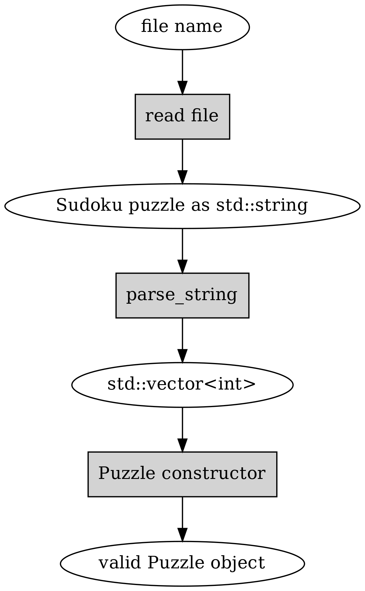

Sudoku Puzzle class
-------------------

Now, we can start implementing our Puzzle class. From data point of view, this is nothing else but an array of cells. Let's declare this:

.. code-block:: cpp

    class Puzzle {
        public:
            Puzzle();
            bool solved() const;

        private:
            std::array<Cell, 81> cells;
    };

*Exercise*: Implement the constructor and the "solved" function. The constructor doesn't need any contents as the array elements will be constructed using the default constructor for Cell, which as per the previous exercise initialises the cell such that all values are possible. The "solved" function will need to check whether all cells have only one number, and only return true in this case. (Initially, it should hence return false.)
Now, we can look into actually constructing an object of class Puzzle by reading a Sudoku puzzle from a file.

As per Norvig, let's define the file format for a Sudoku puzzle such that a number in a file defines the value for a cell, while either a dot (.) or a zero (0) denote an unknown cell, and all characters can be ignored. This means that e.g. the following line is a valid puzzle (courtesy QQWing, an open source Sudoku puzzle generator):

::

    1..42.........6.............51.4..87..3.5..61...3....528...7..4......5..6.5.18.2.

The same puzzle could be represented like this:

::

    1.. 42. ...
    ... ..6 ...
    ... ... ...

    .51 .4. .87
    ..3 .5. .61
    ... 3.. ..5

    28. ..7 ..4
    ... ... 5..
    6.5 .18 .2.

Now, let's write the code to read this. In C++, one can read a file to a string with the following snippet (this uses the first parameter given to the program):

.. code-block:: cpp

    #include <iostream>
    #include <fstream>
    #include <string>

    int main(int argc, char** argv)
    {
        std::ifstream ifs(argv[1]);
        std::string contents((std::istreambuf_iterator<char>(ifs)),
                (std::istreambuf_iterator<char>()));
        return 0;
    }

Now that we can read file into a string, let's turn this into a puzzle. We want to implement the following:

In other words, we want to read the file to an std::string, pass this string to a function called parse_string() (which we still need to write) which shall convert the std::string to a vector of integers. Once we have a vector of integers we'll pass it to our Puzzle constructor which shall use this vector to set the correct values in the member variable of type std::array<Cell, 81>. Phew!

The interfaces for parse_string() and the Puzzle constructor would hence look like the following:

.. code-block:: cpp

    int main()
    {
         std::string s = /* ... */;
         std::vector<int> values = parse_string(s);
         Puzzle b(values);
         return 0;
    }

We see here how the Puzzle class constructor shall receive an std::vector<int> as input. Each element in the vector should either be a number between 1 or 9, denoting a pre-filled cell, or something else (like 0) to denote a clear cell. We should also have a function "parse_string" to turn the string to an int vector.

As a skeleton, let's put something together that also introduces character-to-integer conversions in C++, exceptions and reference parameters.

.. code-block:: cpp
    :linenos:

    std::vector<int> parse_string(const std::string& s) {
        int buf_location = 0;
        std::vector<int> my_buf;
        for(auto c : contents) {
            if(c >= '1' && c <= '9') {
                my_buf.push_back(c - '0');
            } else if(c == '.' || c == '0') {
                /* TODO */
            }
            if(buf_location == 81) {
                /* TODO */
            }
        }
        throw std::runtime_error("Unable to parse");
    }

Let's go through this line by line:

* Line 1: We define the function such that it takes a parameter "const std::string& s". A simpler version to write effectively the same thing would be "string s", however the latter would cause the input string to be copied for the function. With the former version we receive a reference to a constant string instead, saving an unnecessary data copy.
* Line 2: We define a variable to keep track of the current cell we might fill.
* Line 3: We define our return variable.
* Line 4: We iterate over all characters in the string.
* Line 5: We check if the character value is between '1' and '9'. As the character values are based on the ASCII table, meaning they can be treated as numeric values, we can use arithmetic operators (>= and <=) to compare them.
* Line 6: We subtract the ASCII value '0' from "c". This results in the integer value 0 for the character '0', 1 for character '1', 2 for character '2' etc.
* Line 7: We check whether the character is a dot or a zero.
* Line 10: We check whether we've found a symbol for each cell in the puzzle.
* Line 14: If we didn't find enough symbols of interest, then we cannot fill our array of cells any further and *throw an exception*: this effectively ends the current execution of the code and goes up the function call stack until a caller is found who *catches* the exception thrown. As we have no code to catch the exception, this effectively prints the error message on the screen and terminates the program.

.. topic:: Digression: What do you mean, "subtract the ASCII value"?

  You may remember from the section "C and strings" that ASCII is a mapping between characters and numbers. Our variable 'c' is a character, but also a number. E.g. the character '3' is equivalent to the number 51 in ASCII. Hence, by subtracting 48 ('0') from 'c' we end up at the number which the ASCII character represents. By pushing the result of this subtraction to the std::vector<int> we implicitly convert the result to an int.

*Exercise*: Implement the above function. Fill out the correct code for the TODOs such that the return variable is updated correctly and returned. See if you can run it without an exception being thrown with the example input from above.

Now that we're able to parse a string to an int vector, let's turn this int vector to a Puzzle.

*Exercise*: Rewrite the constructor of the Puzzle class to take an int vector as a parameter, and loop through it to set the contents of the "cells" member variable. Use the "set" member function of the Cell class to set the values.

Displaying puzzles
==================

We're now able to read in a Sudoku puzzle but have no visibility over the contents of the Puzzle class. To remedy this, let's write a function to display the puzzle. Here's the declaration:

.. code-block:: cpp

    class Puzzle {
        public:
            ...
            void print() const;
            ...
    };

That is, a public member function which doesn't modify the object.

Now, we can implement this function by looping through the array of cells, and for each cell, print out something. What we print should have the same number of characters for each cell for proper formatting. The simplest way to do this is to either print out a number if a cell has one, or a placeholder (e.g. a space or a dot) otherwise.

*Exercise*: Implement this function and test it.

We can now start thinking about the meat of our program: actually implementing the first strategy of constraint propagation. Recall that what we want to do is:

1) For each cell that has only a single value set, eliminate that value from all its peers
2) Since eliminating a value from a cell can cause it to only have a single value set, if this is the case, we should eliminate that value from all its peers

In order to implement this, what we need is:

1) A function to eliminate a value from a cell
2) Identifying what the peers are for a cell
3) A function that calls the above functions, i.e. checks, for all cells, which values can be eliminated

We already implemented 1) when we implemented the Cell class. Let's implement 2) next.

Finding Sudoku peers
====================

Recall that the peers of a cell are the cells that are on either the same horizontal line, on the same vertical line, or in the same 3x3 sub-grid, i.e. in the same *unit* as the cell.

On the interface for our function that finds the peers, it seems like an easy way to encode cell positions could be to use integers which represent the index in our cell array. For example, an integer 0 would mean the first element in our array, or the cell at the very top left in the puzzle. The integer 50 would represent 50 % 9 = 5th column (0-indexed) and 50 / 9 = 5th row, or the bottom right cell in the middle 3x3 sub-grid.

This suggests we have the function declaration:

.. code-block:: cpp

    class Puzzle {
        public:
            ...

        private:
            std::vector<int> peers(int index) const;
            ...
    };

That is, our function takes an integer as a parameter (which cell to find peers for), returns a vector of integers (which cells are the peers), and doesn't modify the data within the Puzzle object. Furthermore our function is *private* as it's not necessary to call this function from outside the class.

Now, here's one way to find the indices to the cells that are in the same vertical line:

.. code-block:: cpp
    :linenos:

    std::vector<int> Puzzle::peers(int index) const
    {
        std::vector<int> ret;

        int column = index % 9;
        for(int i = 0; i < 9; i++) {
            int peer_index = i * 9 + column;
            if(peer_index != index) {
                ret.push_back(peer_index);
            }
        }

        return ret;
    }

Let's go through this in detail.

* Line 3: Our return variable.
* Line 5: We calculate *the column* for the given index by dividing by 9 and taking the remainder. This means that e.g. indices 4, 13, 22 etc. all return the same column (4).
* Line 6: We define a loop that goes through nine elements.
* Line 7: We calculate the *peer index* by multiplying the variable "i" by 9 and adding the column. This means that e.g. with index 4 we get 4, 13, 22 etc.
* Line 9: We add the peer index in the return variable.

Now, let's add the missing logic.

*Exercise*: Add the logic for the horizontal lines and the 3x3 grids in the above function. Try it out.

.. topic:: Digression: static member functions

  You may have noticed that our function above not only does not modify the data in the Puzzle object ("cells" array), it doesn't even read it. This means it could actually be a free standing function and doesn't have to be a member function of the Puzzle class. On the other hand, it may be convenient to group functions that are relevant for certain classes together. There's a mechanism for this: *static member functions*. You can declare one by including the keyword "static" at the beginning of the declaration. You'll then need to name the class when calling it. Here's an example:

  .. literalinclude:: ../material/sudoku/static.cpp
    :language: cpp

  You mustn't use the keyword "const" to annotate the function const as it's a static function and hence won't be able to access object data anyway.

