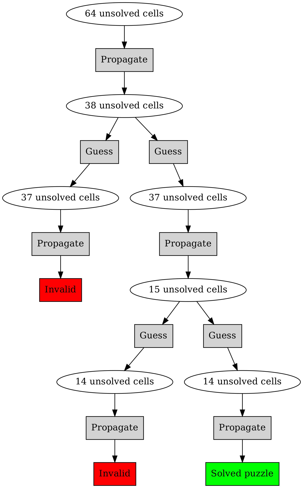

Propagation and search
----------------------

We now have the means to eliminate a value from a cell, and to find the peers of a cell. This means we can put everything together and implement the actual propagation function.

Let's put this function together in C++:

.. code-block:: cpp
    :linenos:

    bool Puzzle::propagate(int i)
    {
        bool has_only_one = cells[i].has_one();
        if(has_only_one) {
             auto value = cells[i].get_one();
             auto peers = peers(i);
             for(const auto& peer : peers) {
                 if(cells[peer].has(value)) {
                     bool still_valid = cells[peer].eliminate(value);
                     if(!still_valid)
                         return false;
                     still_valid = propagate(peer);
                     if(!still_valid)
                         return false;
                 }
             }
        }
        return true;
    }

The summary of this function is that we go through each cell, and if it only has one value, we eliminate the value from the peers if they had it. If a peer ends up only having one value, we repeat for that cell. If we invalidate the puzzle with this (which shouldn't happen), we stop.

Now, a couple of notes:

* Line 3: We previously introduced the Cell class member function "has_one". This is used here.
* Line 5: We need an additional function to get the single value (although "get_values" could be used as well).
* Line 6: We call the function "peers" which returns the peers of a cell.
* Line 7: We iterate through all the peers.
* Line 8: We can access the peers in the "cells" array by index "peer", and call the Cell class member function "has" which should return true if the value is possible for the cell. The function is yet to be defined.
* Line 10: We call the function that's being defined for the peer; recursion. What happens is another function call is pushed to the stack, such that we enter the function "propagate" again but with the variable "i" being set to "peer" for this second call. Once that function call returns then we end up at line 10 again, with "i" at the original value, continuing the original for loop to process the rest of the peers. With recursion, it's important to have a *base case*, i.e. a case where the recursive call will not be made, to avoid infinite loop. Our base cases are either no cells having only one value, or all peers already having a single value.

Recursion is generally equivalent to iteration (e.g. for loops) but can be useful because, like in this case, the stack of variables to use is implicitly stored in the call stack. Were one to replace recursion with iteration in this case, one would need to add another variable to hold the indices where elimination is required.

The following diagram demonstrates how the function uses recursion to propagate the elimination through the cells:

.. image:: ../material/sudoku/rec.png

What we have here, after filling out the blanks, is the propagation function, which eliminates numbers from peer cells, and also propagates this if the peer cell ends up with only one value.

*Exercise*: Implement the "get_one" and "has" member functions for the Cell class.

*Exercise*: What happens when the user of the Cell class calls "get_one" but the cell has more than one value? What is the cell has no values at all (all numbers eliminated)? What would you expect to happen? Is it possible to improve the has_one/get_one interface to avoid invalid use?

Now, let's put everything together:

* Parse the Sudoku puzzle from the previous section into a Puzzle object
* Call propagate() whenever you set a value of a cell
* Check if it's already solved using the solved() function
* Print out the puzzle after reading it

If everything works correctly, your program should be able to solve the example Sudoku puzzle just by using constraint propagation alone.

*Exercise*: Put everything together and see if you can solve the first puzzle. If not, debug.

Now we have enough to solve one easy Sudoku puzzle, but our program won't solve most puzzles, especially not the difficult ones. To test, here's one more difficult puzzle:

::

    .7...18......7......6..91.....415.78...6.345........1.56..3....78...6.499...5....

Searching
=========

The next puzzle to solve is searching. Recall that we wanted to propagate constraints where possible but at some point we won't be able to progress any further and have to guess (search). How searching should work in principle is this:

* We pick one cell where we make a guess (namely the one with the least possible options to minimise the number of searches)
* We make a copy of the current puzzle and make a guess on this copy (by calling the "set" member function of the cell object)
* We propagate this guess
* If propagation shows we've solved the puzzle, we're done
* If propagation shows we haven't solved the puzzle but can't progress any further, we repeat this (search recursively again on this board)
* If propagation shows we've ended up with an invalid puzzle (wrong guess), we throw out this copy and guess a different number on the same cell. If we've tried all numbers then we've made a wrong guess at some point before and return from our (recursive) function call.

What we have here is *depth-first search*. It's called depth first because we follow one "path" until we either find the solution, in which case we return this, or a dead end, in which case we try the next path. It's similar to trying to find the exit from a maze by always following the wall on one side; you may have to traverse the maze quite a lot but you'll find the exit eventually (if it exists). This is in contrast to *breadth-width search* which, instead of following one path down, visits each neighbouring node first before progressing further down the graph.

The following diagram illustrates depth-first search by example:

Here, we start with 64 unsolved cells. After propagation, we still have 38 so we have to guess. After a guess and a propagation we find we have an invalid puzzle so the guess was wrong. We then make another guess and propagate, leading to 15 unsolved cells. We make a guess and propagate, but find an invalid puzzle again. We backtrack and make another guess, and propagate, which finally leads us to the solved puzzle.

Generally speaking we can agree on the following structure:

* The Puzzle class has a member function "search", which, when called, will return a Puzzle class which is expected to be the solved puzzle
* The "search" member function does the following:

  * Check if this puzzle is solved; if so then return self
  * Check if any of the cells in this puzzle are invalid, i.e. don't have any valid options; if so then return self
  * Find the cell with the smallest number of valid options (but still more than 1)
  * For all the options in the selected cell, make a copy of the puzzle, set a value in the copy, search in the copy; if solution found then return it, else return self

Now, in terms of syntax, there are a couple of useful things to know.

Working with "this"
===================

In C++, "this" is a keyword which means a pointer to the current object. In our case, it allows us to make a copy of our object. Here's an example use:

.. code-block:: cpp
    :linenos:

    Puzzle Puzzle::search()
    {
        if(solved()) {
            return *this;
        } else {
            int cell_index_to_guess = /* ... */
            auto possible_guesses = cells.at(cell_index_to_guess).values();
            for(auto guess : possible_guesses) {
                Puzzle alt = *this;
                alt.set_cell(cell_index_to_guess, guess);
                bool valid = alt.propagate();
                if(valid) {
                    alt = alt.search();
                    if(alt.solved()) {
                        return alt;
                    }
                }
            }
        }
        return *this;
    }

Here, we define a function named "search" which is a member function of the class Puzzle. It has Puzzle as its return value. We check if this Puzzle is solved, and if so, we return the *dereferenced pointer* to "this", meaning a copy of the Puzzle. If this Puzzle is not solved we call "search" recursively. (Because we set a cell value each time we search, we either find a solution or a dead end.)

*Exercise*: Finish the above function. Call it from your program. See if you can solve the more difficult Sudoku puzzle.

Solving more Sudoku puzzles
===========================

.. only:: html

  Here are 30 easy Sudoku puzzles, courtesy QQWing, an open source Sudoku puzzle generator: :download:`download link <../material/sudoku/sud1.txt>`

.. only:: not html

  There is a file downloadable at the book web site containing 30 easy Sudoku puzzles, courtesy QQWing, an open source Sudoku puzzle generator.

*Exercise*: Save the above to a file. Rewrite your program to read each of these, and solve them all one after another. See how long it takes. (On Unix, you can time your program execution by prefixing the command with "time", e.g. "time ls".)

.. only:: html

  Here are 30 difficult Sudoku puzzles, courtesy QQWing: :download:`download link <../material/sudoku/sud2.txt>`

.. only:: not html

  There is a file downloadable at the book web site containing 30 difficult Sudoku puzzles, courtesy QQWing.

*Exercise*: Solve these puzzles as well. If you get tired of waiting, remember to compile your program with optimisations, that is, with the compiler command line flag "-O2" which can speed up C++ programs significantly.

Constraint propagation with units
=================================

We've missed one part of our plan: in the introduction we said that "another common strategy is to see if a number has been ruled out for all cells in a unit except one. In this case it must be the correct number for that cell."

This means that if e.g. we have a row where a cell could have values 2, 3 and 7, but the number 7 was eliminated in all peers, then we can assign the number 7 for this cell.

*Exercise*: Implement this strategy as part of the propagation function. Note that you may find it necessary to use recursion. See if this strategy speeds up your program execution. You may want to reuse parts of your function to identify peers of a cell, and rewrite it to suit you better.

Now we have a program that can solve all Sudoku puzzles fairly quickly.

*Exercise*: Look up Peter Norvig's essay on solving Sudoku puzzles online, which served as inspiration for this chapter.
