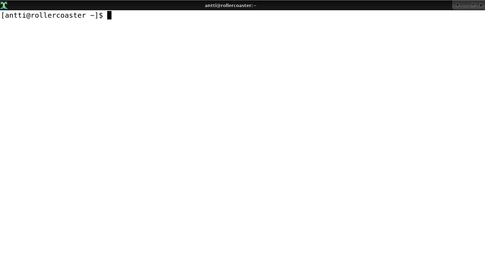
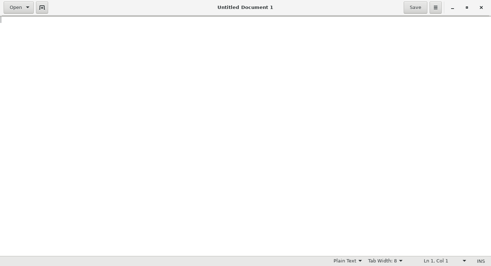

What is software?
-----------------

  Talk is cheap. Show me the code.
  
  -- Linus Torvalds

Software is code that tells computer hardware what to do.

To get started, let's write a very simple software program.

For this, the first thing you need to do is start a terminal with a Unix shell in it.

I can't tell you how to do this exactly as this is operating system (OS) dependent. At least with some versions of Mac OS, you can start the terminal by searching for "terminal" in Spotlight. On Windows 10, you can install "Windows Subsystem for Linux" (WSL). On older Windowses, there are ways to get a Unix shell like Cygwin but it's more tricky. Searching online is your friend.

In the end, it could look something like this:

Most notably, the Windows cmd.exe or PowerShell are *not* Unix shells. Typical Unix shells characteristics are the at sign ("@") designating your user name and the host name of the computer you're logged on to, a tilde ("~") to designate the home directory and the dollar sign ("$") to designate the prompt. You can use these to identify whether you're running a Unix shell or not.

*Exercise*: Start a terminal with a Unix shell.

Apart from the shell, we also need an interpreter and an editor. For this section we'll use Python as our programming language; so let's install the Python interpreter. Again, I can't tell you how to do this; some OSes may have it already installed. To find out if you have it, start your Unix shell and try typing:

.. code-block:: bash

    $ python
    Python 3.6.0 (default, Jan 16 2017, 12:12:55)
    [GCC 6.3.1 20170109] on linux
    Type "help", "copyright", "credits" or "license" for more information.

.. topic:: I'm supposed to type all that?

  Actually you're only supposed to type "python" (without quotes). On the first line, the dollar sign ("$") means the prompt, i.e. the part of the screen where you can type. The first line effectively means "type 'python'". The following lines don't start with the dollar sign so they're meant to demonstrate the possible output from running the previous command.

If you don't have Python, you might see something like this instead:

.. code-block:: bash

    $ python
    bash: python: command not found

In this case you'll need to find out how to install it. On e.g. Ubuntu, running something like "sudo apt-get install python" might do it. On Mac you may need to install Python from the Python official web site. Although we'll be using Python 2 later in this book, this section will work with either Python 2 or 3 so the version you pick isn't very important for now.

Once you do get to the Python interpreter as shown above you can exit it by typing "exit()" (without the quotes).

*Exercise*: Install the Python interpreter if your system doesn't already have it. Run it and exit it.

Now that we have the shell and the interpreter, the final bit we need is the editor. For now it's enough with an editor that's easy to use, though Notepad, which is installed by default on Windows, won't do. If you're on a Linux system you can install e.g. gedit. On Windows you could install notepad++. There are other editors available like Atom or Visual Studio Code. It doesn't really matter which one you install now, as long as you end up with a window where you can type text and save it to a file. Here's an example of what an editor could look like:

*Exercise*: Install and start an editor.

Now we can use the editor to write some code and save it in a file, then use the shell to start the interpreter with our code as input. The interpreter will then run our code.

The next step is to create a file with these contents:

.. code-block:: python

    print("Hello world")

The above is a one-line Python program (which works either with Python 2 or Python 3). When run, it will write the text "Hello world" to the terminal.

*Exercise*: Create a file with the above contents. Call it "hello.py". Make sure you know in which directory you saved the file.

Now, we need to navigate to the directory where the file was saved, and run the Python interpreter with our program as the input.

The directory paths are again somewhat OS dependent but you have a few tools that help you locate your file:

* You can find out which files are in the *current directory* in the shell by running "ls".
* You can find out what your current directory is by running "cwd" (current working directory).
* You can change the directory by running "cd" followed by the directory. E.g. if you have a directory called "Documents" in your current working directory and you wish to change your current working directory to that directory, you can do this by running "cd Documents".
* You can change to the *parent directory* by running "cd ..".

*Exercise*: Run "ls" in your shell to see the contents of the current working directory.

Now we have some idea of how to navigate around the various directories in our Unix shell.

*Exercise*: Locate your hello.py in the shell. Change to that directory. If you can't find it, try saving to another location. If you're on Windows you may need to consult the Windows documentation on how to find the Windows files from WSL or vice versa. If you're stuck, you may also try to open the editor from the shell e.g. by running "gedit hello.py" (if gedit is the editor you have installed). This way, after saving the file in your editor, the file should be saved in the current working directory.

Now that you have your source file available, let's run the interpreter with your source file as input by running:

.. code-block:: bash

    $ python hello.py
    Hello world

This should cause the Python interpreter to run your program which will output the text "Hello world" on the screen.

*Exercise*: Run your program.

If you made it here, congratulations. You've written your first software.
