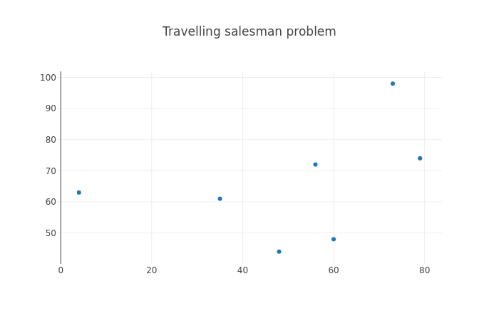
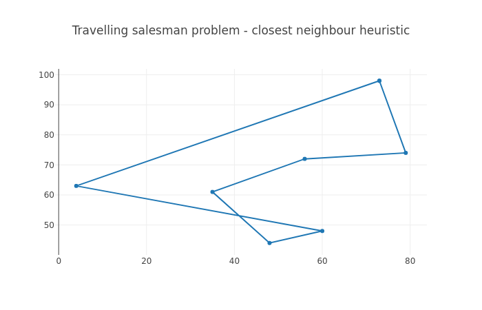

NP-hard problems
----------------

In the chapter "First touch of algorithms" we discussed the run times of various algorithms (O(log n) etc.). There's more to this, namely problems which, to the best of current knowledge of mankind, are *hard*. Hard here means that the run time of an algorithm to solve the problem is expected to be high, and it's not known how to construct an algorithm that has a run time polynomial to n, i.e. the complexity class isn't O(n\ :sup:`x`\ ) for any x but rather e.g. exponential (O(2\ :sup:`n`\ ), i.e. incrementing n by one doubles the run time).

There are several classifications from classical Computer Science for problems, such as *P* (solvable in polynomial time), *NP-complete* ("NP" standing for non-deterministic polynomial time) etc. which are not in the scope for this book, but the summary is that for certain problems, fast solutions are not known. This section discusses one of such problems in detail, namely the *Traveling salesman problem*.

Travelling salesman problem (TSP)
=================================

TSP is one of the classical Computer Science problems. Imagine set of cities with distances defined between all cities, and a salesman who intends to visit all of the cities. The goal is to find the shortest path to visit all the cities and return to the starting point.

Let's see if we can solve this. Let's start with generating the input data. The following should get you started:

.. code-block:: python

    import random

    random.seed(21)
    N = 5

    input_data = list()
    for i in xrange(N):
        x = random.randint(0, 100)
        y = random.randint(0, 100)
        input_data.append((x, y))

Here, we set the *random seed* to a predefined number, causing the random number generator to always generate the same numbers each time our code is run. This is useful for us as we'll be running our code multiple times and want to keep the problem the same each time. We furthermore set N, the number of cities, to 5, and generate N coordinates where the X and Y values are integers between 0 and 100.

The following diagram displays an example of TSP, for N=7:

The most naive way to solve TSP is *brute force search*: trying out all combinations and picking the best one. Before we can implement this, let's write a few helper functions.

*Exercise*: Write a function that returns the distance between two cities using the Pythagorean theorem.

*Exercise*: Write a function that returns the total length of the path. It should, as input, take a list of tuples, whereby each element in the list is a city. The total length of the path is the sum of the distances between each city in the list. Test your function with some simple dummy data.

Now we can get to the meat of the problem and implement the brute force search.

*Exercise*: Implement the brute force search function which shall find the shortest path between the different cities. Note that the path must begin and end at the same location. You can find all the *permutations*, i.e. all the possible path combinations by running the following Python code: "all_permutations = list(itertools.permutations(input_data))" (you'll need to "import itertools" first). Print out the shortest path and the length of the path.

The following diagram displays an example of a brute force search solution to TSP, for N=7:

.. image:: ../material/close/tsp2.png

Now, things get interesting if we increase N. The brute force search to TSP has the runtime complexity of O(n!), that is, each time N is increased, the runtime is *multiplied* by N. The number of permutations for N=5 is 5 * 4 * 3 * 2 * 1 = 120. For N=6 it is 120 * 6 = 720.

If we assume we require four bytes to store each permutation in RAM (quite optimistic), how much memory would we require to store all the permutations for different values of N?

*Exercise*: With the above assumption, calculate the possible memory requirements. You can use "math.factorial(n)" to calculate the factorial in Python, and convert bytes to kilobytes by dividing by 1024.0, or to megabytes by dividing by 1024.0 * 1024.0, or to gigabytes by dividing by 1024.0 * 1024.0 * 1024.0. Find out the memory requirements for N from 1 to 20.

Now, let's examine the run time of our brute force search.

*Exercise*: Try to increment N from 5, one at a time. Measure the impact on the run time of your script. You can use the command "time" to measure time to execute a command in Unix shell (e.g. "time python2 tsp.py"). Don't increase N to a higher number than you have RAM available on your machine (or if you do, save any of your work before).

Now, the brute force search may be slow for increasing N, but it does find the optimal solution. Can you come up with a faster algorithm? Have a think.

One possible approach is called the *next neighbour algorithm*. This algorithm works as the following:

1. Pick any city as the starting city (current city).
2. Find the city that is nearest to the current city that hasn't yet been visited.
3. Set the nearest city as the current city and mark it as visited.
4. Repeat until all cities have been visited.

Now, this may seem like it could result in the optimal solution. In some cases it does, but in most cases it produces a longer path than the optimal. Indeed, in some cases it may produce the worst possible path. An algorithm that produces an approximate solution but is faster than finding the optimal solution is called a *heuristic*.

The following image displays an example path found by the next neighbour algorithm.

Here, it's possible that the path started at (60, 48). It found the nearest neighbour at (48, 44), then at (35, 61) and so on, until the final city at (4, 63) and the return to the starting point.

*Exercise*: Implement the next neighbour algorithm. Compare the resulting path length between this and the brute force search for various N, e.g. N=8.

The next neighbour algorithm is a *greedy algorithm*. A greedy algorithm is an algorithm which attempts to find the locally optimal solution repeatedly with the hope of arriving as close to the globally optimal solution as possible. It only looks at the local state such that the decision e.g. to set a city as the current city does not consider all solutions or future decisions. Algorithms that combine the solutions of subproblems and do consider all solutions and future decisions are called *dynamic programming* algorithms. The fastest algorithms to find the optimal solution to TSP utilise dynamic programming; they have a run time complexity of O(n\ :sup:`2`\ 2\ :sup:`n`\ ) which is still exponential but much better than factorial.

Were it actually necessary to find good and fast solutions to TSP, the best way to do this would probably be to use one of multiple libraries designed to solve TSP, which may incorporate years of optimisation and research to provide the best algorithms. Never the less, basic understanding of the problem space can be helpful in daily programming life. Furthermore, typical Computer Science topics are often a popular subject in technical interviews for software development positions.
