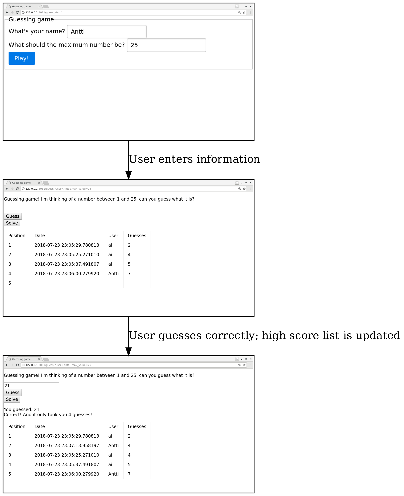
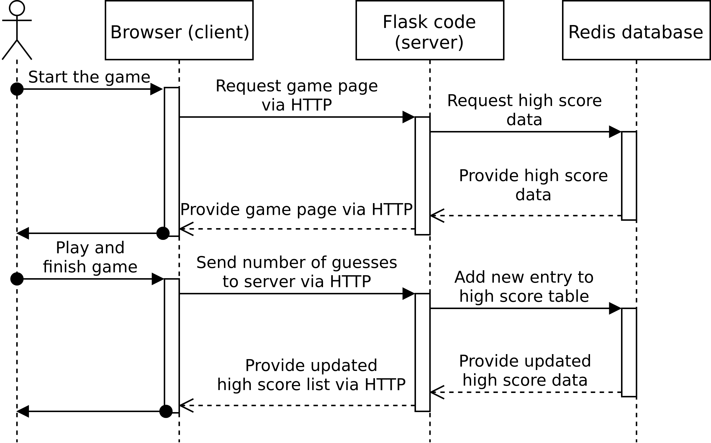

High level architecture
-----------------------

In this section we'll discuss the high level architecture for our web app.

Let's beging with the requirements. Remember that what we wanted to do was have a high score list for our guessing game. We'll have two HTML pages. The first one is the entry point for the user and allows them to enter their name as well as the maximum number that the computer will think of. This information will be used in the second page for the actual guessing game which will also include the high score table.

Here is an illustration of what we want to achieve:

In order to do this, we need to have a database which stores the high scores. In order to have and use the database, we need to have some *server side* code. This means we get to pull up Flask, our web microframework again, as it has the capability of running a web server which we need going forwards.

We have the following constraints:

* The client (browser) displays HTML and executes JavaScript
* The server has direct access to the database while the client does not

These constraints have implications for the overall architecture. The following is a *sequence diagram* and displays, at a high level, the interactions between different components over time.

Here, the time is on the Y axis and advances from top to bottom. The user wants to play the game, and as a result their browser will contact our server. Our server will want to provide a HTML page with the necessary information including the high score list. In order to do this, our server code will contact the database, retrieve the necessary data, and use this data to generate the proper HTML. Once the user has guessed the correct number, the browser will tell this to the server which will update the database and also the client with the new high score list.

In terms of communication, we hence have the following:

* Once the user has guessed the correct number, as we want to store this in the database, the client will need to send this information to the server
* In order to update the high score table on the page, the server will need to send the information about the high score list to the client
* The above should happen without having to refresh or reload the page

*Exercise*: Move your guessing game HTML to be served by Flask. To do this, as per Flask documentation, you need to 1) create a directory named "templates" and move your HTML file there; 2) Set up a Flask "hello world" program such that there's a URL which serves your HTML file (using render_template()); and 3) Start Flask and try it out to ensure everything is set up correctly.

In the next section we'll investigate how we can implement the communication between the client and the server.
