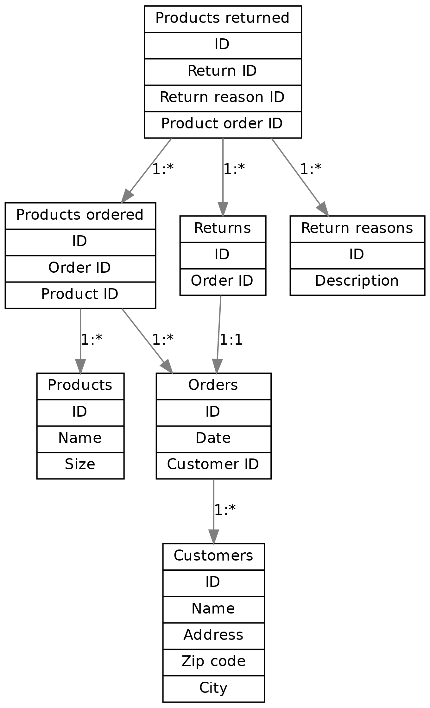

Introduction to SQL
-------------------

As mentioned in section "Redis", SQL is a language for querying databases, and there are several SQL databases which support this language, or their own dialect thereof, for the database operations. There are several reasons to use or not use an SQL database vs. a no-SQL database, but some reasons why we might want to use an SQL database for this kind of an application are:

* The data is relatively heavily *relational* - there are relationships between e.g. products and orders, orders and customers, and returns and orders. SQL has built in support for working with relations.
* SQL typically works with a fixed *database schema*, making it somewhat more robust against errors in the code that operates with the database
* Several SQL databases are *ACID* compliant - ACID standing for "Atomicity", "Consistency", "Isolation" and "Durability" - which means they intend to be robust against errors such as power failures etc.

Generally, when starting from scratch with SQL (or with databases even more generally), the flow is something like the following:

* Decide on the *schema* for your data - how do you want to store it? What data is it that you want to store? What are the relationships between different kinds of data?
* Implement the schema in a database of your choice by creating the necessary *tables* which will hold the data.
* Use your database: add your data in it, query for data, modify and delete data.

We'll be using SQLite in this book which is an SQL database similar to e.g. MySQL, Postgres etc. There are pros and cons to each database but I picked SQLite for this book because:

* The setup is fairly simple. SQLite, as the name implies, is a fairly lightweight database. While most other commonly used SQL databases operate in the server-client mode, i.e. the database administrator (DBA) would set up the database to run on a server computer while the clients (program using the database) would connect to it over the network, SQLite operates *locally*, i.e. the database is simply a file that SQLite will read and write to from our code, and no server process is necessary.
* The core SQL syntax is more or less the same for all SQL databases. While each database has their own features and extensions to SQL, we will focus on the basics (like for everything else in this book) and won't go very much into database specific features.

There are a few ways to use SQLite. It includes a command line program which supports all database operations including creating a new database. For example, after you've installed SQLite, you can run:

.. code-block:: bash

    $ sqlite3 my_db
    SQLite version 3.16.2 2017-01-06 16:32:41
    Enter ".help" for usage hints.
    sqlite> create table my_table(my_number integer);
    sqlite> insert into my_table values(5);
    sqlite> insert into my_table values(7);
    sqlite> select * from my_table;
    5
    7
    sqlite>

The above creates a new database called "my_db" with one table called "my_table" which has one column "my_number" which holds integers, and two rows with values 5 and 7. You can then find a file with the name "my_db" which is the database. (You can think of tables a bit like sheets in a spreadsheet program; they have a fixed number of columns, and you can add, remove and query for rows in the table.)

*Exercise*: Install SQLite and try it out. Bonus points if you compile it from source.

Database schemas
================

Now that we're able to use SQLite let's consider what we need to store there. As our focus is generating the return form PDF, let's take a look at what the expected output could be like: :download:`pdf <../material/retail/example.pdf>`

Don't focus on the details (e.g. the U.S. zip code "15443" is actually in Pennsylvania, not in Washington D.C.) but the objects we want to include are:

* At the top left, the company name and our logo (you can dream something up and draw a logo yourself, like I did)
* Name and address of the customer below the logo
* Bar code which encodes the return number at the top right
* The order number below the bar code
* A text "Return label", and a table of products that are returned: product number, description, size and a reason code
* A table at the bottom describing the reason codes

The idea is that the customer fills in the necessary information about the products to return and the reason for return on our web page, then clicks a link which generates a PDF like the one above.

Now, what would we need to have in the database for generating this? What "objects", or entities do we have, and what data is associated with them?

* There are customers, with a name and an address
* There are products, with a number, a name and a size
* There are orders by customers for certain products
* There are returns of some orders where some products are returned, and a reason associated to each product
* The returns reasons and the associated codes can also be stored in the database

Some of this is straightforward but we're making a few decisions here, e.g.:

* We assume a product is associated with a size, i.e. the same piece of clothing with a different size has a different product number. This is for simplicity's sake but could be designed differently.
* We assume that if a customer orders some product multiple times but returns some of them, each item is listed on a separate row on the PDF. That means we don't need to have a "quantity" column in our PDF, nor in our returns table in the database.

To identify each customer, product, order etc. we use *identifiers*, or *primary keys*. E.g. customer number 12345 will refer to a certain specific customer.

We can now specify our first table. Let's call it "customers". This SQL statement will create a new table:

.. code-block:: sql

    CREATE TABLE customers(id INTEGER PRIMARY KEY,
                           name TEXT,
                           address TEXT,
                           zipcode TEXT,
                           city TEXT);
    
This means the following:

* We CREATE a new TABLE which is called "customers"
* It has five fields: "id", "name", "address", "zipcode" and "city"
* The field "id" is an integer, and a primary key. SQLite will be able to generate this automatically, and will do so in an autoincrement fashion, i.e. the first customer added will have id 1, second will be id 2 etc.
* The other fields are all text

One note is that the SQL keywords such as "create" and "table" can be written either upper case or lower case. In this book I'll write them in upper case to distinguish from table and column names and which are in lower case.

Now, you could run the above command in the SQLite shell, but another way to do this is by writing a Python script that does this for us. Indeed we should strive to have a script that can generate a new, empty database with our schema from scratch so that we can easily iterate as needed, including removing an old test database and creating a new one or trying out changes in the schema. A Python script that creates this table could look e.g. like the following:

.. code-block:: python
    :linenos:

    import sqlite3

    db = sqlite3.connect('mydb')
    cursor = db.cursor()

    cursor.execute('DROP TABLE if exists customers')
    db.commit()

    cursor.execute('''
            CREATE TABLE customers(id INTEGER PRIMARY KEY,
                                   name TEXT,
                                   address TEXT,
                                   zipcode TEXT,
                                   city TEXT)''')
    db.commit()
    db.close()

Let's go through this line by line:

* Line 1: We import the sqlite3 module which is included with Python.
* Line 3: We connect to a SQLite database called "mydb". This is the file name of the database. You can use whatever name you like. This function returns a database object. If the database doesn't yet exist then SQLite will automatically create it.
* Line 4: We obtain a *cursor* to the database which is an object allowing us to perform some database operations.
* Line 6: We *drop* the table "customers" if it already exists, i.e. delete it.
* Line 7: We *commit* our changes, i.e. write them in the file. Before this, the table removal was only stored in RAM but not written to the database file.
* Lines 9-14: We run our SQL statement to create a table. This uses Python multi-line strings using the ''' notation.
* Line 15: We commit our change to create the table.
* Line 16: We close the connection to the database.

*Exercise*: Run the above code. In addition, add code to create a table for the products. Call it "products". Each product should have an ID as the primary key, as well as name and size. The name and size can both be stored as text.

How about the relationships? There might not need to be a direct relationship e.g. between a customer and a product, but an order is always made by a specific customer. That means that the "orders" table will need to have another column, namely a value to *reference* the customer number of the customer who made the order. Furthermore we should tell SQLite that we intend to use this column to refer to an ID from another table as this way SQLite is able to prevent invalid data which could occur if some rows were removed in one table but not in the other. Such a column is called a *foreign key*.

We can create the table "orders" with a foreign key using the following statement:

.. code-block:: python

    cursor.execute('''
            CREATE TABLE orders(id INTEGER PRIMARY KEY,
                                   date DATE,
                                   customer_id INTEGER,
                                   FOREIGN KEY(customer_id) REFERENCES customers(id))''')

Here, we define the column "customer_id" as a normal integer, but then include a line that tells this column is a foreign key which references the column "id" from the table "customers".

The field "date" holds a date of the order. When using SQLite with Python, we can create date fields by simply creating a string with format "YYYY-MM-DD" (ISO 8601 format).

Now that we have tables for customers, products and orders, we should come up with some way to describe which products were ordered with each order.

An order can include multiple products, and a product can be included in multiple orders (we don't take things like availability of a product in stock into account here; there can be multiple items of one product). This means that between an order and a product there is a *many-to-many* relationship. This is interesting because in SQL we need another table to model this kind of a relationship, namely a table that includes both products and orders as foreign keys (also called junction table). You can think of it as a mapping table describing which products belong to which orders, and vice versa. Such a table can be created like this:

.. code-block:: python

    cursor.execute('''
            CREATE TABLE products_ordered(id INTEGER PRIMARY KEY,
                                          order_id INTEGER,
                                          product_id INTEGER,
                                          FOREIGN KEY(order_id) REFERENCES orders(id),
                                          FOREIGN KEY(product_id) REFERENCES products(id))''')

Here, we have a table with an ID like before, and two foreign keys, to orders and products. This table could look confusing at first glance, e.g.:

..

    +----+----------+------------+
    | id | order_id | product_id |
    +----+----------+------------+
    |  1 |       34 |        977 |
    +----+----------+------------+
    |  2 |       34 |        755 |
    +----+----------+------------+
    |  3 |       35 |        854 |
    +----+----------+------------+

In this example we have three rows. The first two have the same order ID so they both describe the order number 34. For that order, products 977 and 755 were ordered. The last row describes order 35 for which product 854 was ordered.

Now, the only tables we're missing are those related to returning products. Remember, we want to note in the database when a customer wants to return products after ordering them for more automated return workflow at the warehouse. Here's one way we could define the table holding this information:

.. code-block:: python

    cursor.execute('''
            CREATE TABLE returns(id INTEGER PRIMARY KEY,
                                 order_id INTEGER UNIQUE,
                                 FOREIGN KEY(order_id) REFERENCES orders(id))''')

Here, we define a table with two columns. The first one, "id" is our primary key like before. The second one, "order_id" is a foreign key almost like before, but we also include the keyword "UNIQUE". This causes SQLite to check that no two rows in this table have the same order_id. In practice this means our customers won't be able to send more than one return package from one order. We could enforce a policy like this to save shipping costs, but it also simplifies our code later.

The above table doesn't describe which products will be returned, or the reason for returning.

*Exercise*: Create a table for describing the return reasons. It needs to have an ID as a primary key as well as a text column that describes the reason.

*Exercise*: Create a table that describes which products were returned. It needs to describe the many-to-many relationship between ordered products and returns. Hence, apart from the ID as the primary key, it needs three more columns, all of which need to be foreign keys: the return ID, the reason ID and the ID to the table in "products_ordered", our mapping table describing the products in an order.

We now have our schema defined in code. It's often useful to also draw a diagram of the schema. In our case, it could look like this:

Here, we have one box for each table, and one arrow for each foreign key reference. The labels describe the relationship between the tables, e.g. "1:\*" between orders and customers reads as "one customer can have many orders". All relationships between the tables are one-to-many except the relationship between and order where each order can have (up to) one return. Several one-to-many relationships between tables lead to many-to-many relationships via junction tables, such that we have a many-to-many relationship e.g. between products and orders.

Now that we have our schema defined, the next step is using it by adding data to it.
